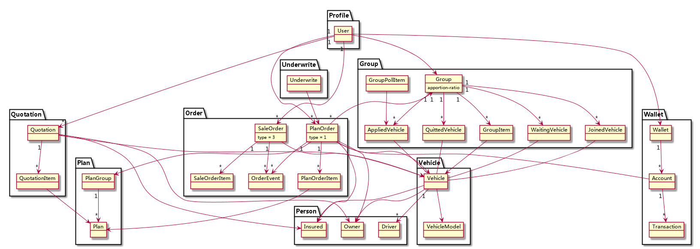

<!-- START doctoc generated TOC please keep comment here to allow auto update -->
<!-- DON'T EDIT THIS SECTION, INSTEAD RE-RUN doctoc TO UPDATE -->
**Table of Contents**  *generated with [DocToc](https://github.com/thlorenz/doctoc)*

- [设置](#%E8%AE%BE%E7%BD%AE)
- [运行](#%E8%BF%90%E8%A1%8C)
- [数据](#%E6%95%B0%E6%8D%AE)
- [文档](#%E6%96%87%E6%A1%A3)
- [例外](#%E4%BE%8B%E5%A4%96)

<!-- END doctoc generated TOC please keep comment here to allow auto update -->

MockServer

MockServer 是蜂巢互助服务仿真程序，通过 vue-hive-rpc 插件在页面中调用，可得到预
先保存在 data 目录下的仿真数据。

设置
----

    npm install

运行
----

    node mockserver.js

数据
----

数据以 json 作为数据格式，按模块划分目录，用方法名作为文件名前缀，保存在 data 目
录下。

比如下面的 rpc 调用:

    rpc.call("module0", "function0", "argument0", "argument1");

将会获取 `data/module0/function0.json` 中的数据。如果该文件不存在，则 MockServer
返回 404 错误信息。

文档
----

[险种模块](doc/project.md)

[计划模块](doc/plan.md)

[车辆模块](doc/vehicle.md)

[报价模块](doc/quotation.md)

[人员模块](doc/person.md)

[订单模块](doc/order.md)

[钱包模块](doc/wallet.md)

[用户模块](doc/profile.md)

[互助组模块](doc/group.md)

[短信验证码模块](doc/checkcode.md)

[OSS 模块](doc/oss.md)

[移动代理](doc/mobile.md)

例外
----

| code | meaning                      |
| ---- | ----                         |
| 307  | 用户未通过 wechat 授权       |
| 400  | 模块参数类型错误             |
| 403  | 模块方法不存在或当前域无权限 |
| 405  | 无效的 rpc 请求              |
| 429  | 请求超过处理上限             |
| 500  | 服务器错误                   |
| 502  | 后端模块请求超时(nginx)      |
| 504  | 后端模块请求超时             |
| 540  | 响应数据解码失败             |
