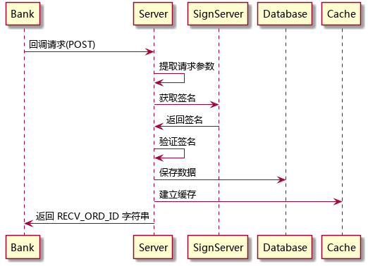
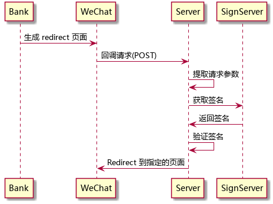
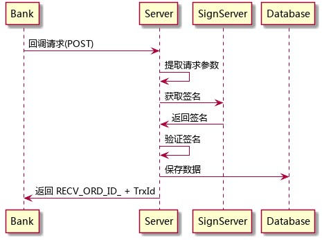

<!-- START doctoc generated TOC please keep comment here to allow auto update -->
<!-- DON'T EDIT THIS SECTION, INSTEAD RE-RUN doctoc TO UPDATE -->
**Table of Contents**  *generated with [DocToc](https://github.com/thlorenz/doctoc)*

- [ChangeLog](#changelog)
- [Cache](#cache)
- [Database](#database)
  - [bank\_customers](#bank%5C_customers)
  - [bank\_mer\_customers](#bank%5C_mer%5C_customers)
  - [bank\_netsave](#bank%5C_netsave)
- [API](#api)
  - [register](#register)
  - [RegisterCallback](#registercallback)
  - [netsave](#netsave)
  - [NetSaveCallback](#netsavecallback)

<!-- END doctoc generated TOC please keep comment here to allow auto update -->


bank-callback 是一个特殊的模块，不遵循 hive-server 和 hive-processor 的约定。bank-callback 模块启动一个 web server，供银行业务系统进行回调。

# ChangeLog

1. 2016-11-19
  * 增加刷新缓存

1. 2016-11-16
  * 修改 bank-customers 的 field。openid 改为 pnrid
  * 修改 bank\_customers 表结构，把 openid 改为 pnrid
  * 增加 toc


1. 2016-09-25
  * 增加缓存设计。
  * 增加调用序列图。

# Cache

| key                | type | value              | note                          |
| ----               | ---- | ----               | ----                          |
| bank-customers     | hash | pnrid => custid    | pnrid 与 custid 的对应关系    |
| bank-mer-customers | hash | usrId => usrCustid | usrId 与 usrCustid 的对应关系 |

注意：openid 只有 25 个字节长。

# Database

## bank\_customers

| field       | type      | null | default | index   | reference |
| ----        | ----      | ---- | ----    | ----    | ----      |
| id          | uuid      |      |         | primary |           |
| pnrid       | char(25)  |      |         |         |           |
| cust\_id    | char(16)  |      |         |         |           |
| created\_at | timestamp |      | now     |         |           |
| updated\_at | timestamp |      | now     |         |           |
| deleted     | boolean   |      | false   |         |           |


## bank\_mer\_customers

| field          | type        | null | default | index   | reference |
| ----           | ----        | ---- | ----    | ----    | ----      |
| id             | uuid        |      |         | primary |           |
| usr\_id        | varchar(25) |      |         |         |           |
| usr\_name      | varchar(50) |      |         |         |           |
| usr\_cust\_id  | varchar(16) |      |         |         |           |
| audit\_stat    | char(1)     |      |         |         |           |
| trx\_id        | char(18)    |      |         |         |           |
| open\_bank\_id | varchar(8)  |      |         |         |           |
| card\_id       | varchar(40) |      |         |         |           |
| created\_at    | timestamp   |      | now     |         |           |
| updated\_at    | timestamp   |      | now     |         |           |
| deleted        | boolean     |      | false   |         |           |


## bank\_netsave

| field       | type      | null | default | index   | reference |
| ----        | ----      | ---- | ----    | ----    | ----      |
| id          | uuid      |      |         | primary |           |
| cust\_id    | char(16)  |      |         |         |           |
| ord\_id     | char(30)  |      |         |         |           |
| data        | json      |      |         |         |           |
| done        | boolean   |      | false   |         |           |
| created\_at | timestamp |      | now     |         |           |
| updated\_at | timestamp |      | now     |         |           |
| deleted     | boolean   |      | false   |         |           |

充值回调的其它参数用 json 格式存放在 data 字段中。done 字段表明该数据是否被后台服务所处理。

# API

## register

register 响应银行的开户回调，调用参数与返回结果见《汇付天下P2P系统托管平台接口规范-v2.7.0\_20160603.pdf》

register 的数据保存到 bank\_customers 表中，同时更新 bank-customers 缓存。



## RegisterCallback

RegisterCallback 响应银行的开户页面响应，提取响应编码和响应内容，用 redirect 方式将客户端转移到前端页面。

| 场景 | 内容                                                    |
| ---- | ----                                                    |
| 正式 | http://m.fengchaohuzhu.com/#/BankUserRegisterCallback   |
| 测试 | http://dev.fengchaohuzhu.com/#/BankUserRegisterCallback |



## netsave

netsave 响应银行的充值回调，调用参数与返回结果见《汇付天下P2P系统托管平台接口规范-v2.7.0\_20160603.pdf》

netsave 的数据保存到 bank\_netsave 表中, 核心数据保存 cust\_id 和 ord\_id，其余数据以 json 格式保存在 data 字段中。



## NetSaveCallback

NetSaveCallback 响应银行的开户页面响应，提取响应编码和响应内容，用 redirect 方式将客户端转移到前端页面。

| 场景 | 内容                                           |
| ---- | ----                                           |
| 正式 | http://m.fengchaohuzhu.com/#/NetSaveCallback   |
| 测试 | http://dev.fengchaohuzhu.com/#/NetSaveCallback |

*调用序列图见开户页面回调*

## RefreshRedis

RefreshRedis 从数据库 bank\_customers 中获取数据刷新 Redis \"bank\-customers\" 与 \"customers\-pnrid\"

模拟汇付天下报文，将 \"CmdId=RefreshRedis\" 发送到特定地址：

| 场景 | 内容                                           |
| ---- | ----                                           |
| 正式 |  http://m.fengchaohuzhu.com/bank/RefreshRedis   |
| 测试 |  http://dev.fengchaohuzhu.com/bank/RefreshRedis |

```
curl --data "CmdId=RefreshRedis" http://dev.fengchaohuzhu.com/bank/RefreshRedis
```