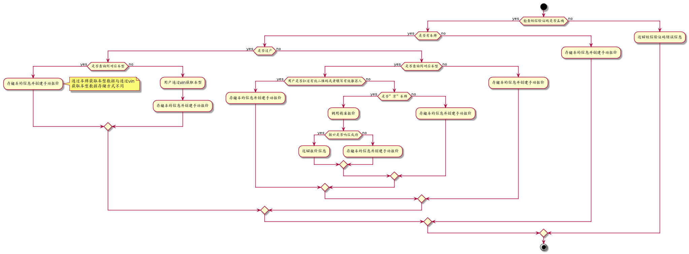
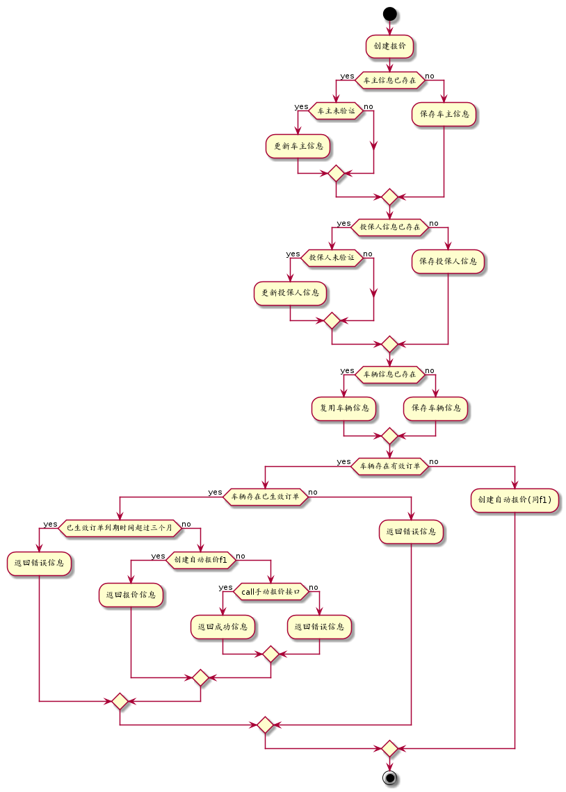

<!-- START doctoc generated TOC please keep comment here to allow auto update -->
<!-- DON'T EDIT THIS SECTION, INSTEAD RE-RUN doctoc TO UPDATE -->
**Table of Contents**  *generated with [DocToc](https://github.com/thlorenz/doctoc)*

- [ChangeLog](#changelog)
- [API](#api)
  - [createQuotation](#createquotation)
      - [request](#request)
      - [response](#response)
  - [getLastQuotations](#getlastquotations)
      - [request](#request-1)
      - [response](#response-1)
  - [getQuotation](#getquotation)
      - [request](#request-2)
      - [response](#response-2)
  - [saveOrderPdf](#saveorderpdf)
      - [request](#request-3)
      - [response](#response-3)
  - [getUnpaidOrders](#getunpaidorders)
      - [request](#request-4)
      - [response](#response-4)
  - [addDrivers](#adddrivers)
      - [request](#request-5)
      - [response](#response-5)
  - [cancel](#cancel)
      - [request](#request-6)
      - [response](#response-6)
  - [getHiveStatistics](#gethivestatistics)
      - [request](#request-7)
      - [response](#response-7)
  - [updateInsuredPhone](#updateinsuredphone)
      - [request](#request-8)
      - [response](#response-8)
  - [creatPlanOrder](#creatplanorder)
      - [request](#request-9)
      - [response](#response-9)
  - [getQRCode](#getqrcode)
      - [request](#request-10)
      - [response](#response-10)

<!-- END doctoc generated TOC please keep comment here to allow auto update -->

# ChangeLog

1. 2017-04-25
  * 增加getQRCode方法

1. 2017-04-14
  * 增加createPlanOrder方法

1. 2017-04-06
  * 修改并完善getHiveStatistics接口中的字段名

1. 2017-03-29
  * 增加 updateInsuredPhone 方法

1. 2017-03-28
  * 增加 cancel(已创建订单) 方法,增加 getHiveStatistics(获取首页数据) 方法

1. 2017-03-16
  * 删除 createDriverOrder 方法，增加 addDrivers 方法

1. 2017-03-09
  * 增加 saveOrderPdf　方法
  * 增加 getUnpaidOrders 方法 

1. 2017-03-04
  * 删除 createQuotation 的 average_mileage
  * 删除 createQuotation 的 transfer_date
  * 删除 createDriverOrder 方法
  * 删除 checkTicketOrRecommender 方法

1. 2017-03-01
  * 接口getLastQuotation名字修改为getLastQuotations

1. 2017-02-28
  * 增加 创建报价流程图

1. 2017-02-25
  * 增加 receipt_no,receipt_date 参数到　createQuotation
  * 修改 createQuotation 流程图中对是否创建报价的逻辑判断

1. 2017-02-22
  * 增加 checkTicketOrRecommender 方法
  * 删除 createQuotation 方法的 phone 参数
  * 重命名 createQuotation 方法的 owner 参数为 owner_name
  * 重命名 createQuotation 方法的 identity_no 参数为 owner_identity_no
  * 增加 insured_name 参数到 createQuotation
  * 增加 insured_identity_no 参数到 createQuotation
  * 增加 insured_phone 参数到 createQuotation

1. 2017-02-10
  * 增加 createDriverOrder

1. 2017-02-06
  * 增加 getLastQuotation

1. 2017-02-04
  * 增加 createQuotation

# API

## createQuotation

创建报价，流程如下：





| domain | accessable |
| ----   | ----       |
| admin  |            |
| mobile | ✓          |

#### request

| name                   | type    | note                         |
| ----                   | ----    | ----                         |
| verify_code            | string  | 手机验证码                   |
| city_code              | string  | 城市编码                     |
| vehicle_code           | string  | 车型编码                     |
| vin                    | string  | 车辆vin码                    |
| license_no             | string  | 车牌                         |
| engine_no              | string  | 发动机号                     |
| register_date          | date    | 车辆注册日期                 |
| is_transfer            | boolean | 是否过户车                   |
| last_insurance_company | string  | 最近一次投保的保险公司       |
| insurance_due_date     | date    | 保险到期日期                 |
| fuel_type              | string  | 燃油类型                     |
| accident_status        | string  | 最近出险状况                 |
| owner_name             | string  | 车主姓名                     |
| owner_identity_no      | string  | 车主身份证件编号             |
| insured_name           | string  | 投保人姓名                   |
| insured_identity_no    | string  | 投保人身份证件编号           |
| insured_phone          | string  | 投保人电话号码               |
| insurer_code           | string  | 保险公司编码                 |
| recommend              | string  | 推荐人                       |
| receipt_no             | string  | 发票编号　　　　　　　　　   |
| receipt_date           | date    | 发票开具日期　　　　　　　　 |

#### response

成功：

| name | type | note |
| ---- | ---- | ---- |
| code | int  | 200  |
| data | uuid | qid  |

失败：

| name | type   | note |
| ---- | ----   | ---- |
| code | int    |      |
| msg  | string |      |

| code | meanning |
| ---- | ----     |
| 500  | 未知错误 |

## getLastQuotations

得到用户最后一次的报价，流程如下：

1. 获得用户名下的所有车辆;

2. 遍历所有车辆，得到最后一次的报价。

| domain | accessable |
| ----   | ----       |
| admin  |            |
| mobile | ✓          |

#### request

| name | type | note |
| ---- | ---- | ---- |

#### response

成功：

| name | type        | note |
| ---- | ----        | ---- |
| code | int         | 200  |
| data | [quotation] |      |

失败：

| name | type   | note |
| ---- | ----   | ---- |
| code | int    |      |
| msg  | string |      |

| code | meanning |
| ---- | ----     |
| 500  | 未知错误 |

## getQuotation

通过qid获取报价列表信息

| domain | accessable |
| ----   | ----       |
| mobile | ✓          |

#### request

| name | type   | note   |
| ---- | ----   | ----   |
| qid  | string | 报价ID |

```javascript
rpc.call("mobile", "getQuotation", qid)
  .then(function (result) {

  }, function (error) {

  });
```

#### response

注: code 200时，返回结果data是布尔型，满足情况为true,否则为false

| name | type    | note |
| ---- | ----    | ---- |
| code | int     | 200  |
| data | boolean | true |


## saveOrderPdf

存储保单数据

| domain | accessable |
| ----   | ----       |
| mobile | ✓          |

#### request

| name | type   | note   |
| ---- | ----   | ----   |
| mail | string | 邮箱    |
| phone| string | 电话号码 |


```javascript
rpc.call("mobile", "saveOrderPdf", mail, phone)
  .then(function (result) {

  }, function (error) {

  });
```

#### response

注: code 200时，保存成功

| name | type    | note |
| ---- | ----    | ---- |
| code | int     | 200  |


## getUnpaidOrders

获取用户未支付订单

| domain | accessable |
| ----   | ----       |
| mobile | ✓          |

#### request

| name | type   | note   |
| ---- | ----   | ----   |


```javascript
rpc.call("mobile", "getUnpaidOrders", qid)
  .then(function (result) {

  }, function (error) {

  });
```

#### response

注: code 200时，返回结果data是返回的未支付订单订单号组成的数组

| name | type    | note |
| ---- | ----    | ---- |
| code | int     | 200  |


## addDrivers

 添加驾驶人,支持添加多个驾驶人

| domain | accessable |
| ----   | ----       |
| mobile | ✓          |

#### request

| name | type   | note   |
| ---- | ----   | ----   |
| oid  | uuid   | 订单id | 
| drivers| drivers[]| 驾驶人信息|

```javascript

var drivers = [
  {
    name: "",
    identity_no: "",
  }
];

rpc.call("mobile", "addDrivers", oid, drivers[])
  .then(function (result) {

  }, function (error) {

  });
```

#### response


| name | type    | note |
| ---- | ----    | ---- |
| code | int     | 200  |

## cancel

取消未支付订单

| domain | accessable |
| ----   | ----       |
| mobile | ✓          |

#### request

| name | type   | note   |
| ---- | ----   | ----   |
|oid   | uuid   | 订单ＩＤ|

```javascript
rpc.call("mobile", "cancel", oid)
  .then(function (result) {

  }, function (error) {

  });
```

#### response


| name | type    | note |
| ---- | ----    | ---- |
| code | int     | 200  |
| data | string  | oid  |


## getHiveStatistics

　获取首页统计数据

| domain | accessable |
| ----   | ----       |
| mobile | ✓          |

#### request

| name | type   | note   |
| ---- | ----   | ----   |

```javascript


rpc.call("mobile", "getHiveStatistics")
  .then(function (result) {

  }, function (error) {

  });
```

#### response

注: data中数据结构为：{ effective_orders: 生效订单数, total_money: 生效互助金总额, case_times: 申请互助次数,case_times_ongoing:正在进行的互助事件数, case_end_times:结束的互助事件总数, case_money: 互助总额, average_case_period: 平均剩余互助期, percentage_of_case_period: 剩余互助期百分比, percentage_of_case_money_remaining: 剩余互助金额百分比, deadline: 截止时间 }

| name | type    | note |
| ---- | ----    | ---- |
| code | int     | 200  |
| data | json    | hiveStatistics|

## updateInsuredPhone

修改投保人手机号

| domain | accessable |
| ----   | ----       |
| mobile | ✓          |

#### request

| name | type   | note   |
| ---- | ----   | ----   |
| pid  | uuid   | person_id |
| phone| string | 新手机号|
| verify_code|string| 验证码 |

```javascript


rpc.call("mobile", "updateInsuredPhone", pid, phone, verify_code) 
  .then(function (result) {

  }, function (error) {

  });
```

#### response


| name | type    | note |
| ---- | ----    | ---- |
| code | int     | 200  |
| data | uuid    | pid  |

## creatPlanOrder

创建计划订单

| domain | accessable |
| ----   | ----       |
| mobile | ✓          |

#### request

| name                   | type    | note                       |
| ----                   | ----    | ----                       |
| verify_code            | string  | 手机验证码                   |
| vid                    | string  | 车辆ＩＤ　　　　　　　　　　　　 |
| qid                    | string  | 报价ＩＤ　                   |
| owner_name             | string  | 车主姓名                     |
| owner_identity_no      | string  | 车主身份证件编号             |
| insured_name           | string  | 投保人姓名                   |
| insured_identity_no    | string  | 投保人身份证件编号           |
| insured_phone          | string  | 投保人电话号码               |
| plans                  | {pid: type} | 计划 ID 列表            |
| expect_at              | date        | 期望生效日期           |
| recommend              | string  | 推荐人                       |

```javascript


rpc.call("mobile", "creatPlanOrder", verify_code,  qid, owner_name, owner_identity_no, insured_name, insured_identity_no, insured_phone, plans, expect_at, recommend) 
  .then(function (result) {

  }, function (error) {

  });
```

#### response


| name | type    | note |
| ---- | ----    | ---- |
| code | int     | 200  |
| data | uuid    | oid  |


## getQRCode

创建计划订单

| domain | accessable |
| ----   | ----       |
| mobile | ✓          |

#### request

| name  | type    | note |
| ----  | ----    | ---- |

```javascript


rpc.call("mobile", "getQRCode") 
  .then(function (result) {

  }, function (error) {

  });
```

#### response


| name | type    | note |
| ---- | ----    | ---- |
| code | int     | 200  |
| data | object  | {nickname:nickname,portrait:portrait,url:url}|

