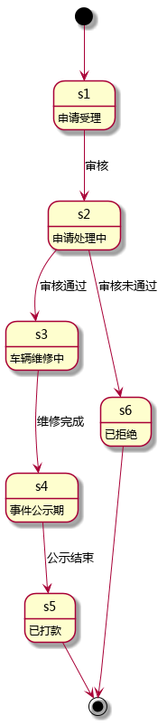

<!-- START doctoc generated TOC please keep comment here to allow auto update -->
<!-- DON'T EDIT THIS SECTION, INSTEAD RE-RUN doctoc TO UPDATE -->
**Table of Contents**  *generated with [DocToc](https://github.com/thlorenz/doctoc)*

- [ChangeLog](#changelog)
- [Data Structure](#data-structure)
  - [mutual-aid](#mutual-aid)
  - [mutual-aid-recompense](#mutual-aid-recompense)
- [Database](#database)
  - [mutual\_aids](#mutual%5C_aids)
- [API](#api)
  - [applyForMutualAid](#applyformutualaid)
      - [request](#request)
      - [response](#response)
  - [getMutualAids](#getmutualaids)
      - [request](#request-1)
      - [response](#response-1)
  - [getMutualAid](#getmutualaid)
      - [request](#request-2)
      - [response](#response-2)

<!-- END doctoc generated TOC please keep comment here to allow auto update -->

# ChangeLog

1. 2016-11-16
  * 增加数据库设计

1. 2016-11-15
  * 增加 toc
  * 修改 mutual-aid-recompense 内部结构

# Data Structure

## mutual-aid

| name                 | type                  | note           |
| ----                 | ----                  | ----           |
| city                 | string                | 市             |
| district             | string                | 区             |
| street               | string                | 街道           |
| driver               | person                | 驾驶员         |
| phone                | string                | 联系电话       |
| vehicle              | vehicle               | 车             |
| occurred-at          | iso8601               | 报案时间       |
| responsibility       | string                | 本车责任       |
| situation            | string                | 出险情形       |
| description          | string                | 简述事件经过   |
| scene-view           | string                | 现场照片       |
| vehicle-damaged-view | string                | 车辆受损照片   |
| vehicle-frontal-view | string                | 车辆正面照片   |
| driver-view          | string                | 驾驶员现场照片 |
| driver-license-view  | string                | 驾驶证照片     |
| state                | integer               | 互助状态       |
| recompense           | mutual-aid-recompense | 扣费记录       |

互助状态转换图:



## mutual-aid-recompense

| name            | type  | note       |
| ----            | ----  | ----       |
| private-fee     | float | 个人扣费   |
| private-balance | float | 个人余额   |
| group-fee       | float | 互助组扣费 |
| group-balance   | float | 互助组余额 |
| public-fee      | float | 公共池扣费 |
| public-balance  | float | 公共池余额 |
| paid-at         | date  | 支付日期   |

# Database

## mutual\_aids

| field                  | type       | null | default | index   | reference |
| ----                   | ----       | ---- | ----    | ----    | ----      |
| id                     | uuid       |      |         | primary |           |
| no                     | char(16)   |      |         |         |           |
| did                    | uuid       |      |         |         | drivers   |
| vid                    | uuid       |      |         |         | vehicles  |
| city                   | char(40)   |      |         |         |           |
| district               | char(40)   |      |         |         |           |
| street                 | char(100)  |      |         |         |           |
| phone                  | char(20)   |      |         |         |           |
| occurred\_at           | timestamp  |      |         |         |           |
| responsibility         | char(20)   |      |         |         |           |
| situation              | text       |      |         |         |           |
| description            | text       |      |         |         |           |
| vehicle\_damaged\_view | char(1024) |      |         |         |           |
| vehicle\_frontal\_view | char(1024) |      |         |         |           |
| driver\_view           | char(1024) |      |         |         |           |
| driver\_license\_view  | char(1024) |      |         |         |           |
| state                  | smallint   |      |         |         |           |
| created\_at            | timestamp  |      | now     |         |           |
| updated\_at            | timestamp  |      | now     |         |           |
| deleted                | boolean    |      | false   |         |           |

# API

## applyForMutualAid

申请互助.

#### request

| name                 | type    | note           |
| ----                 | ----    | ----           |
| city                 | string  | 市             |
| district             | string  | 区             |
| street               | string  | 街道           |
| driver               | uuid    | 司机 ID        |
| phone                | string  | 联系电话       |
| vehicle              | uuid    | 车辆 ID        |
| occurred-at          | iso8601 | 报案时间       |
| responsibility       | string  | 本车责任       |
| situation            | string  | 出险情形       |
| description          | string  | 简述事件经过   |
| scene-view           | string  | 现场照片       |
| vehicle-damaged-view | string  | 车辆受损照片   |
| vehicle-frontal-view | string  | 车辆正面照片   |
| driver-view          | string  | 驾驶员现场照片 |
| driver-license-view  | string  | 驾驶证照片     |

Example

```javascript
var aid = {
  city: "北京",
  district: "东城区",
  street: "东直门",
  driver: "00000000-0000-0000-0000-000000000000",
  phone: "13723687462",
  vehicle: "00000000-0000-0000-0000-000000000000",
  occurred_at: "2016-08-01T00:00:00.000Z",
  responsibility: "全部责任",
  situation: "追尾",
  description: "后车眼瞎，追尾我了，车屁股都撞凹了",
  scene_view: "http://aliyun.com/0.png",
  vehicle_damaged_view: "http://aliyun.com/1.png",
  vehicle_frontal_view: "http://aliyun.com/2.png",
  driver_view: "http://aliyun.com/3.png",
  driver_license_view: "http://aliyun.com/4.png"
};

rpc.call("mutual-aid", "applyForMutualAid", aid).then(function (result) {

}, function (error) {

});
```

#### response

| name | type   | note |
| ---- | ----   | ---- |
| code | int    | 200  |
| data | object |      |
| msg  | string |      |

data 的内容为:

| name          | type   | note          |
| ----          | ----   | ----          |
| mutual-aid-id | uuid   | Mutual Aid ID |
| mutual-aid-no | string | Mutual Aid No |

See [example](../data/mutual-aid/applyForMutualAid.json)

## getMutualAids

互助列表

#### request

| name   | type    | note                     |
| ----   | ----    | ----                     |
| uid    | uuid    | User Id                  |
| offset | integer | 结果在数据集中的起始位置 |
| limit  | integer | 显示结果的长度           |

Example

```javascript
var uid = "00000000-0000-0000-0000-000000000000";

rpc.call("mutual-aid", "getMutualAids", uid, 0, 10)
  .then(function (result) {

  }, function (error) {

  });
```

#### response

| name | type         | note            |
| ---- | ----         | ----            |
| code | int          | 200             |
| data | [mutual-aid] | Mutual Aid List |
| msg  | string       |                 |

See [example](../data/mutual-aid/getMutualAids.json)

## getMutualAid

互助详情

#### request

| name | type | note    |
| ---- | ---- | ----    |
| maid | uuid | 互助 ID |

```javascript
var maid = "00000000-0000-0000-0000-000000000000";
rpc.call("mutual-aid", "getMutualAid", maid).then(function (result) {

}, function (error) {

});
```

#### response

| name | type       | note       |
| ---- | ----       | ----       |
| code | int        | 200        |
| data | mutual-aid | Mutual Aid |
| msg  | string     |            |

See [example](../data/mutual-aid/getMutualAid.json)
