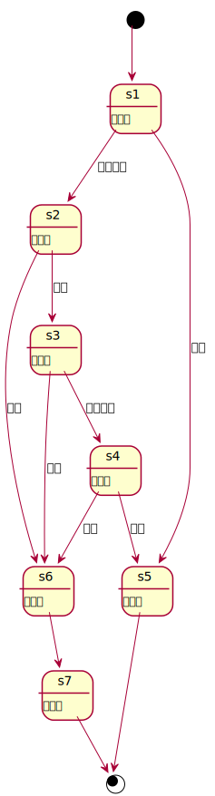
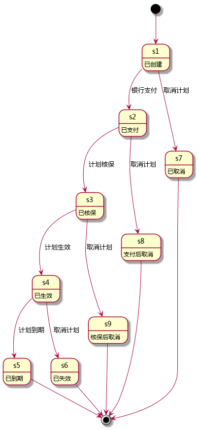
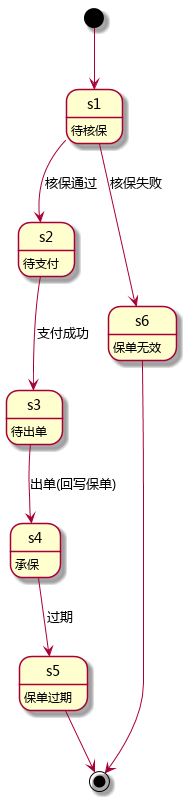

<!-- START doctoc generated TOC please keep comment here to allow auto update -->
<!-- DON'T EDIT THIS SECTION, INSTEAD RE-RUN doctoc TO UPDATE -->
**Table of Contents**  *generated with [DocToc](https://github.com/thlorenz/doctoc)*

- [ChangeLog](#changelog)
- [Data Structure](#data-structure)
  - [sale-order](#sale-order)
  - [sale-order-item](#sale-order-item)
  - [plan-order](#plan-order)
  - [plan-order-item](#plan-order-item)
  - [order-event](#order-event)
    - [plan order states](#plan-order-states)
    - [sale order status](#sale-order-status)
- [Event](#event)
  - [PlanOrderEvent](#planorderevent)
    - [Event Data Structure](#event-data-structure)
    - [Event Type](#event-type)
    - [Event Type And Data Structure Matrix](#event-type-and-data-structure-matrix)
  - [SaleOrderEvent](#saleorderevent)
    - [Event Data Structure](#event-data-structure-1)
    - [Event Type](#event-type-1)
    - [Event Type And Data Structure Matrix](#event-type-and-data-structure-matrix-1)
- [Database](#database)
  - [plan_orders](#plan_orders)
  - [plan_order_items](#plan_order_items)
  - [sale_orders](#sale_orders)
  - [sale_order_items](#sale_order_items)
  - [order_events](#order_events)
  - [order_apply_pdf](#order_apply_pdf)
- [Cache](#cache)
  - [order-entities](#order-entities)
  - [vehicle-plan-order](#vehicle-plan-order)
  - [vehicle-sale-order](#vehicle-sale-order)
- [API](#api)
  - [createPlanOrder](#createplanorder)
      - [request](#request)
      - [response](#response)
  - [pay](#pay)
      - [request](#request-1)
      - [response](#response-1)
  - [underwrite](#underwrite)
      - [request](#request-2)
      - [response](#response-2)
  - [takeEffect](#takeeffect)
      - [request](#request-3)
      - [response](#response-3)
  - [expire](#expire)
      - [request](#request-4)
      - [response](#response-4)
  - [applyWithdraw](#applywithdraw)
      - [request](#request-5)
      - [response](#response-5)
  - [refuseWithdraw](#refusewithdraw)
      - [request](#request-6)
      - [response](#response-6)
  - [agreeWithdraw](#agreewithdraw)
      - [request](#request-7)
      - [response](#response-7)
  - [refund](#refund)
      - [request](#request-8)
      - [response](#response-8)
  - [renameNo](#renameno)
      - [request](#request-9)
      - [response](#response-9)
  - [getPlanOrdersByVehicle](#getplanordersbyvehicle)
      - [request](#request-10)
      - [response](#response-10)
  - [getPlanOrdersByUser](#getplanordersbyuser)
      - [request](#request-11)
      - [response](#response-11)
  - [getPlanOrder](#getplanorder)
      - [request](#request-12)
      - [response](#response-12)
  - [getPlanOrderByQuotation](#getplanorderbyquotation)
      - [request](#request-13)
      - [response](#response-13)
  - [addDrivers](#adddrivers)
      - [request](#request-14)
      - [response](#response-14)
  - [delDrivers](#deldrivers)
      - [request](#request-15)
      - [response](#response-15)
  - [refresh](#refresh)
      - [request](#request-16)
      - [response](#response-16)

<!-- END doctoc generated TOC please keep comment here to allow auto update -->

# ChangeLog

1. 2017-03-15
  * 增加 addDrivers 接口
  * 增加 delDrivers 接口

1. 2017-03-14
  * 增加 owner 到 plan-order
  * 增加 owner 到 order-event
  * 增加 owner 和 insured 到 createPlanOrder 的参数中
  * 重命名 getPlanOrderByQid 为 getPlanOrderByQuotation
  * 增加 amount 保额到 plan-order-item
  * 增加 amount 保额到 plan_order_items 表
  * 增加 drivers 到 plan-order

1. 2017-03-08
  * 重命名 plan_orders 中的 vehicle_real_value 字段为 real_value

1. 2017-03-06
  * 增加 oss_pdf 字段到 plan_orders 表
  * 重命名 RENAME_NO 事件类型为 UPDATE 事件类型
  * 增加 order_apply_pdf 表

1. 2017-02-27
  * 删除 driver order 相关数据结构，数据库和接口
  * 增加 sale order 状态转换图
  * 增加 sale order event
  * 删除 plan-order-item 中的 plan
  * 删除 sale-order-item 中的 plan
  * 增加 title 到 plan-order-item
  * 增加 title 到 sale-order-item
  * 增加 reason 到 plan_order 表
  * 增加 sale_order_items 表
  * 增加 index 到 plan_order_items 表

1. 2017-02-24
  * 删除plan-order中outside-quotation1, outside-quotation2, screenshot1, screenshot2字段
  * 往order-event表里增加字段　last_state
  * 往plan_order_items表里增加字段　title

1. 2017-02-22
  * 重命名 applicant 为 insured

1. 2017-02-18
  * 去掉 plan-order 数据结构中的 quotation, promotion 和 plans 字段
  * 重命名 order-item 为 plan-order-item
  * 重命名 plan-order-item 的 plan-item 属性为 plan
  * 删除 driver-order-items 表中的 price 字段
  * 删除外部队列
  * 删除 getDriverForVehicle 方法
  * 重命名 getPlanOrderByVehicle 方法为 getPlanOrdersByVehicle
  * 重命名 getDriverOrderByVehicle 方法为 getDriverOrdersByVehicle
  * 删除 getOrdersByVid 方法
  * 重命名 getOrders 方法为 getPlanOrdersByUser
  * 重命名 getOrder 方法为 getPlanOrder
  * 重命名 getOrderByQid 方法为 getPlanOrderByQid

1. 2017-02-11
	* 重命名 placeAnDriverOrder 方法为 createDriverOrder
	* 重命名 placeAnSaleOrder 方法为 createSaleOrder
  * 删除 updateSaleOrder 方法
	* 重命名 updatePlanOrderNo 方法为 updateOrderNo
  * 删除 getSaleOrder 方法
	* 重命名 ValidOrder 方法为 getOrdersByVid
	* 重命名 getOrderState 方法为 getOrderByQid
	* 重命名 refresh_order 方法为 refresh
  * 增加 pay 方法
  * 增加 underwrite 方法
  * 增加 takeEffect 方法
  * 增加 expire 方法
  * 增加 applyWithdraw 方法
  * 增加 refuseWithdraw 方法
  * 增加 agreeWithdraw 方法
  * 增加 refund 方法
	* 重命名 updateOrderNo 方法为 renameNo

1. 2017-02-10
  * 删除 driver-order 缓存
  * 删除 plan-order 缓存
  * 删除 sale-order 缓存
  * 删除 orders 缓存
  * 删除 new-orders 缓存
  * 删除 new-pays 缓存
  * 删除 VIN-orderID 缓存
  * 增加 plan-orders 表
  * 增加 plan-order-items 表
  * 增加 driver-orders 表
  * 增加 driver-order-items 表
  * 增加 sale-orders 表
  * 删除 orders 表
  * 删除 plan_order_ext 表
  * 删除 driver_order_ext 表
  * 删除 sale_order_ext 表
  * 删除 order_items 表
  * driver_orders 表增加 uid 字段
  * sale_orders 表增加 uid 字段
  * plan_orders 表增加 evtid 字段
  * driver_orders 表增加 evtid 字段
  * sale_orders 表增加 evtid 字段
  * 删除 getAllOrders 方法
  * 删除 updateOrderState 方法
  * order event 增加 RENAME_NO 事件
	* 重命名 placeAnPlanOrder 方法为 createPlanOrder

1. 2017-02-09
  * 增加 OrderEvent

1. 2017-02-04
  * order 增加投保人

1. 2017-01-09
  * plan order 增加根据订单号获取订单信息

1. 2017-01-03
  * plan order 增加推荐人和推荐 ticket

1. 2016-12-02
  * 移除核保模块

1. 2016-11-14
  * 在 sale-order 中加入 opr-level。
  * 在 plan-order 中加入安盛天平报价，截屏。
  * 在 plan-order 中加入人保报价，截屏。

1. 2016-11-02
  * 在 order 中加入 paid\_at。

1. 2016-11-01
  * 在 plan-order 中增加车辆的真实价值。
  * 修改缓存名称：new-orders-id, new-pays-id

1. 2016-10-24
  * order-items 表将 pid 改为 oid

1. 2016-10-15
  * 增加订单编号

# Data Structure

## sale-order

| name              | type              | note                   |
| ----              | ----              | ----                   |
| id                | uuid              | 主键                   |
| no                | string            | 订单编号               |
| state             | int               | 订单状态编码           |
| state-description | string            | 订单状态               |
| vehicle           | vehicle           | 车辆                   |
| plan              | plan              | 对应的 plan            |
| items             | [sale-order-item] | 包含的 sale-order-item |
| summary           | float             | 订单总额               |
| payment           | float             | 订单实付               |
| start-at          | date              | 合约生效时间           |
| stop-at           | date              | 合约失效时间           |
| paid-at           | date              | 订单支付时间           |
| opr-level         | int               | 选中的三者险           |

## sale-order-item

| name  | type   | note     |
| ----  | ----   | ----     |
| id    | uuid   | 主键     |
| title | string | 计划名称 |
| price | float  | 价格     |

## plan-order

| name              | type              | note              |
| ----              | ----              | ----              |
| id                | uuid              | 主键              |
| no                | string            | 订单编号          |
| state             | int               | 订单状态编码      |
| state-description | string            | 订单状态          |
| vehicle           | vehicle           | 车辆              |
| owner             | person            | 车主              |
| insured           | person            | 投保人            |
| drivers           | [person]          | 司机              |
| items             | [plan-order-item] | 包含的 order-item |
| service-ratio     | float             | 服务费率          |
| summary           | float             | 订单总额          |
| payment           | float             | 订单实付          |
| expect-at         | date              | 预计生效日期      |
| start-at          | date              | 合约生效时间      |
| stop-at           | date              | 合约失效时间      |
| real-value        | float             | 车辆真实价格      |
| paid-at           | date              | 订单支付时间      |
| recommend         | string            | 推荐人            |
| ticket            | string            | 扫码 ticket       |
| reason            | string            | 拒绝原因          |

## plan-order-item

| name   | type   | note     |
| ----   | ----   | ----     |
| id     | uuid   | 主键     |
| title  | string | 计划名称 |
| price  | float  | 价格     |
| amount | float  | 保额     |

保额在下单时根据车辆实际价值计算得到

## order-event

| name        | type | note                |
| ----        | ---- | ----                |
| id          | uuid | 主键                |
| oid         | uuid | 订单 ID             |
| uid         | uuid | 触发事件的人        |
| last_state  | int  | 上一个事件订单状态  |
| data        | json | JSON 格式的事件数据 |
| occurred-at | date | 事件发生时间        |

### plan order states

[](订单状态转换图)
[](计划订单状态转换图)

### sale order status

[](第三方订单状态转换图)

# Event

## PlanOrderEvent

### Event Data Structure

| name          | type     | note         |
| ----          | ----     | ----         |
| id            | uuid     | event id     |
| type          | smallint | event type   |
| opid          | uuid     | operator id  |
| oid           | uuid     | order id     |
| order-type    | smallint | order type   |
| occurred-at   | iso8601  | 事件发生时间 |
| summary       | float    | 总金额       |
| payment       | float    | 应付金额     |
| qid           | uuid     | quotation id |
| vid           | uuid     | vehicle id   |
| expect-at     | iso8601  | 期盼生效时间 |
| start-at      | iso8601  | 生效时间     |
| stop-at       | iso8601  | 失效时间     |
| real-value    | float    | 车辆实际价值 |
| recommend     | string   | 推荐人       |
| ticket        | string   | 推荐码       |
| reason        | string   | 拒绝理由     |
| oss-pdf       | string   | oss pdf      |
| no            | string   | 订单编号     |
| insured       | uuid     | 投保人 ID    |
| owner         | uuid     | 车主 ID      |
| promotion     | float    | 促销金额     |
| service_ratio | float    | 服务费率     |

### Event Type

| type | name            | note         |
| ---- | ----            | ----         |
| 0    | CANCEL          | 取消订单     |
| 1    | CREATE          | 创建订单     |
| 2    | PAY             | 支付订单     |
| 3    | UNDERWRITE      | 订单核保     |
| 4    | TAKE_EFFECT     | 订单生效     |
| 5    | EXPIRED         | 订单到期     |
| 6    | APPLY_WITHDRAW  | 申请提现     |
| 7    | REFUSE_WITHDRAW | 拒绝提现申请 |
| 8    | AGREE_WITHDRAW  | 同意提现申请 |
| 9    | REFUND          | 银行退款     |
| 10   | UPDATE          | 更新订单信息 |


### Event Type And Data Structure Matrix

| type | summary | payment | qid  | vid  | expect-at | start-at | stop-at | real-value | recommend | ticket | reason | oss-pdf | no   | insured | owner | promotion | service-ratio |
| ---- | ----    | ----    | ---- | ---- | ----      | ----     | ----    | ----       | ----      | ----   | ----   | ----    | ---- | ----    | ----  | ----      | ----          |
| 0    |         |         |      |      |           |          |         |            |           |        |        |         |      |         |       |          |               |
| 1    | ✓       | ✓       | ✓    | ✓    | ✓         |          |         | ✓          | ?         | ?      |        | ?       | ✓    | ?       | ?     |✓         | ✓             |
| 2    |         | ✓       |      |      |           |          |         |            |           |        |        |         |      |         |       |          |               |
| 3    |         |         |      |      |           | ✓        | ✓       |            |           |        |        |         |      |         |       |          |               |
| 4    |         |         |      |      |           |          |         |            |           |        |        |         |      |         |       |          |               |
| 5    |         |         |      |      |           |          |         |            |           |        |        |         |      |         |       |          |               |
| 6    |         |         |      |      |           |          |         |            |           |        |        |         |      |         |       |          |               |
| 7    |         |         |      |      |           |          |         |            |           |        | ✓      |         |      |         |       |          |               |
| 8    |         |         |      |      |           |          |         |            |           |        |        |         |      |         |       |          |               |
| 9    |         |         |      |      |           |          |         |            |           |        |        |         |      |         |       |          |               |
| 10   | ?       | ?       |      |      | ?         | ?        | ?       | ?          | ?         | ?      | ?      | ?       | ?    | ?       | ?     | ?        | ?             |

## SaleOrderEvent

### Event Data Structure

| name        | type     | note         |
| ----        | ----     | ----         |
| id          | uuid     | event id     |
| type        | smallint | event type   |
| opid        | uuid     | operator id  |
| oid         | uuid     | order id     |
| order-type  | smallint | order type   |
| occurred-at | iso8601  | 事件发生时间 |
| summary     | float    | 总金额       |
| payment     | float    | 应付金额     |
| qid         | uuid     | quotation id |
| vid         | uuid     | vehicle id   |
| expect-at   | iso8601  | 期盼生效时间 |
| start-at    | iso8601  | 生效时间     |
| stop-at     | iso8601  | 失效时间     |
| no          | string   | 订单编号     |
| insured     | uuid     | 投保人 ID    |

### Event Type

| type | name        | note     |
| ---- | ----        | ----     |
| 0    | CANCEL      | 取消订单 |
| 1    | CREATE      | 创建订单 |
| 2    | UNDERWRITE  | 订单核保 |
| 3    | PAY         | 支付订单 |
| 4    | TAKE_EFFECT | 订单生效 |
| 5    | EXPIRED     | 订单到期 |
| 6    | REFUSE      | 核保失败 |

### Event Type And Data Structure Matrix

| type | summary | payment | qid  | vid  | expect-at | start-at | stop-at | no   | insured |
| ---- | ----    | ----    | ---- | ---- | ----      | ----     | ----    | ---- | ----    |
| 0    |         |         |      |      |           |          |         |      |         |
| 1    | ✓       | ✓       | ✓    | ✓    | ✓         |          |         | ✓    | ✓       |
| 2    |         |         |      |      |           | ✓        | ✓       |      |         |
| 3    |         | ✓       |      |      |           |          |         |      |         |
| 4    |         |         |      |      |           |          |         |      |         |
| 5    |         |         |      |      |           |          |         |      |         |
| 6    |         |         |      |      |           |          |         |      |         |

# Database

## plan_orders

| field             | type          | null | default | index   | reference    |
| ----              | ----          | ---- | ----    | ----    | ----         |
| id                | uuid          |      |         | primary |              |
| no                | char(32)      |      |         | ✓       |              |
| uid               | uuid          |      |         |         | users        |
| pgid              | uuid          | ✓    |         |         | plangroups   |
| qid               | uuid          |      |         |         | quotations   |
| vid               | uuid          |      |         |         | vehicles     |
| state             | smallint      |      | 0       |         |              |
| state_description | string        | ✓    |         |         |              |
| summary           | numeric(10,2) |      | 0.0     |         |              |
| payment           | numeric(10,2) |      | 0.0     |         |              |
| owner             | uuid          |      |         |         | person       |
| insured           | uuid          |      |         |         | person       |
| promotion         | numeric(10,2) | ✓    |         |         |              |
| service_ratio     | numeric(10,2) |      |         |         |              |
| real_value        | numeric(10,2) |      | 0.0     |         |              |
| ticket            | char(96)      | ✓    |         |         |              |
| recommend         | varchar(32)   | ✓    |         |         |              |
| reason            | varchar(128)  | ✓    |         |         |              |
| oss_pdf           | varchar(256)  | ✓    |         |         |              |
| expect_at         | timestamp     |      | now     |         |              |
| start_at          | timestamp     | ✓    |         |         |              |
| stop_at           | timestamp     | ✓    |         |         |              |
| paid_at           | timestamp     | ✓    |         |         |              |
| created_at        | timestamp     |      | now     |         |              |
| updated_at        | timestamp     |      | now     |         |              |
| evtid             | uuid          | ✓    |         |         | order_events |

## plan_order_items

| field  | type     | null | default | index   | reference   |
| ----   | ----     | ---- | ----    | ----    | ----        |
| id     | uuid     |      |         | primary |             |
| oid    | uuid     |      |         |         | plan_orders |
| pid    | uuid     |      |         |         | plans       |
| title  | string   |      |         |         |             |
| price  | float    |      | 0.0     |         |             |
| amount | float    |      | 0.0     |         |             |
| index  | smallint |      | 0       |         |             |

index 是多选项的下标索引，“三块漆”，“六块漆”的下标

## sale_orders

| field             | type      | null | default | index   | reference    |
| ----              | ----      | ---- | ----    | ----    | ----         |
| id                | uuid      |      |         | primary |              |
| no                | char(32)  |      |         | ✓       |              |
| uid               | uuid      |      |         |         | users        |
| vid               | uuid      |      |         |         | vehicles     |
| qid               | uuid      |      |         |         | quotations   |
| type              | smallint  |      | 0       |         |              |
| state             | smallint  |      | 0       |         |              |
| state_description | string    | ✓    |         |         |              |
| summary           | float     |      | 0.0     |         |              |
| payment           | float     |      | 0.0     |         |              |
| insured           | uuid      |      |         |         | person       |
| paid_at           | timestamp | ✓    |         |         |              |
| expect_at         | timestamp |      | now     |         |              |
| start_at          | timestamp |      | now     |         |              |
| stop_at           | timestamp |      | now     |         |              |
| created_at        | timestamp |      | now     |         |              |
| updated_at        | timestamp |      | now     |         |              |
| evtid             | uuid      | ✓    |         |         | order_events |

## sale_order_items

| field | type     | null | default | index   | reference   |
| ----  | ----     | ---- | ----    | ----    | ----        |
| id    | uuid     |      |         | primary |             |
| oid   | uuid     |      |         |         | sale_orders |
| pid   | uuid     |      |         |         | plans       |
| title | string   |      |         |         |             |
| price | float    |      | 0.0     |         |             |
| index | smallint |      | 0       |         |             |

index 是多选项的下标索引

## order_events

| field       | type      | null | default | index   | reference |
| ----        | ----      | ---- | ----    | ----    | ----      |
| id          | uuid      |      |         | primary |           |
| oid         | uuid      |      |         |         |           |
| uid         | uuid      |      |         |         |           |
| event_type  | smallint  |      |         |         |           |
| order_type  | smallint  |      |         |         |           |
| last_state  | smallint  |      |         |         |           |
| data        | json      |      |         |         |           |
| occurred_at | timestamp |      | now     |         |           |

| order type | meanning   |
| ----       | ----       |
| 1          | plan order |
| 3          | sale order |

## order_apply_pdf

| field      | type         | null | default | index   | reference   |
| ----       | ----         | ---- | ----    | ----    | ----        |
| id         | uuid         |      |         | primary |             |
| oid        | uuid         |      |         |         | plan_orders |
| uid        | uuid         |      |         |         | users       |
| phone      | varchar(16)  |      |         |         |             |
| mail       | varchar(128) |      |         |         |             |
| local_addr | varchar(256) |      |         |         |             |
| oss_addr   | varchar(256) |      |         |         |             |
| state      | smallint     |      |         |         |             |
| created_at | timestamp    |      | now     |         |             |
| updated_at | timestamp    |      | now     |         |             |

# Cache

## order-entities

| key            | type | value        | note         |
| ----           | ---- | ----         | ----         |
| order-entities | hash | oid => order | 所有订单实体 |

## vehicle-plan-order

根据 vehicle id 得到对应的计划单

| key      | type | value           | note |
| ----     | ---- | ----            | ---- |
| vid-poid | hash | vid => plan oid |      |

## vehicle-sale-order

根据 vehicle id 得到对应的代售单

| key      | type | value           | note |
| ----     | ---- | ----            | ---- |
| vid-soid | hash | vid => sale oid |      |

# API

## createPlanOrder

创建计划订单

| domain | accessable |
| ----   | ----       |
| admin  |            |
| mobile | ✓          |

#### request

| name      | type        | note         |
| ----      | ----        | ----         |
| qid       | uuid        | 报价 ID      |
| vid       | uuid        | 车辆 ID      |
| owner     | uuid        | 车主 ID      |
| insured   | uuid        | 投保人 ID    |
| plans     | {pid: type} | 计划 ID 列表 |
| expect_at | date        | 期望生效日期 |

type 的定义见 quotation 模块

```javascript
const qid = "00000000-0000-0000-0000-000000000000";
const vid = "00000000-0000-0000-0000-000000000000";
const owner = "00000000-0000-0000-0000-000000000000";
const insured = "00000000-0000-0000-0000-000000000000";
const plans = {
  "1": 0,
  "2": 0,
  "4": 0
};
const expect_at = "2016-08-01T00:00:00.000+800Z";

rpc.call("order", "createPlanOrder", qid, vid, owner, insured, plans, expect_at)
  .then(function (result) {

  }, function (error) {

  });

```

#### response

| name | type   | note     |
| ---- | ----   | ----     |
| code | number | 状态码   |
| data | object | 结构如下 |

| name       | type   | note     |
| ----       | ----   | ----     |
| order-id   | uuid   | Order Id |
| order-no   | string | Order No |
| created-at | Date   | 创建时间 |

## pay

支付订单

| domain | accessable |
| ----   | ----       |
| admin  |            |
| mobile | ✓          |

#### request

| name   | type   | note      |
| ----   | ----   | ----      |
| uid    | uuid   | 用户ID    |
| oid    | uuid   | 订单 ID   |
| amount | number | 支付金额  |

#### response

成功：

| name | type   | note |
| ---- | ----   | ---- |
| code | int    | 200  |
| data | string | oid  |

失败：

| name | type   | note |
| ---- | ----   | ---- |
| code | int    |      |
| msg  | string |      |

| code | meanning |
| ---- | ----     |
| 408  | 请求超时 |

## underwrite

核保订单

| domain | accessable |
| ----   | ----       |
| admin  | ✓          |
| mobile |            |

#### request

| name     | type | note     |
| ----     | ---- | ----     |
| oid      | uuid | 订单 ID  |
| start-at | date | 生效时间 |
| stop-at  | date | 失效时间 |

#### response

成功：

| name | type   | note |
| ---- | ----   | ---- |
| code | int    | 200  |
| data | string | oid  |

失败：

| name | type   | note |
| ---- | ----   | ---- |
| code | int    |      |
| msg  | string |      |

| code | meanning |
| ---- | ----     |
| 408  | 请求超时 |

## takeEffect

订单生效

| domain | accessable |
| ----   | ----       |
| admin  | ✓          |
| mobile |            |

#### request

| name   | type   | note     |
| ----   | ----   | ----     |
| oid    | uuid   | 订单 ID  |

#### response

成功：

| name | type   | note |
| ---- | ----   | ---- |
| code | int    | 200  |
| data | string | oid  |

失败：

| name | type   | note |
| ---- | ----   | ---- |
| code | int    |      |
| msg  | string |      |

| code | meanning |
| ---- | ----     |
| 408  | 请求超时 |

## expire

订单到期

| domain | accessable |
| ----   | ----       |
| admin  | ✓          |
| mobile |            |

#### request

| name | type | note    |
| ---- | ---- | ----    |
| oid  | uuid | 订单 ID |

#### response

成功：

| name | type   | note |
| ---- | ----   | ---- |
| code | int    | 200  |
| data | string | oid  |

失败：

| name | type   | note |
| ---- | ----   | ---- |
| code | int    |      |
| msg  | string |      |

| code | meanning |
| ---- | ----     |
| 408  | 请求超时 |

## applyWithdraw

申请提现

| domain | accessable |
| ----   | ----       |
| admin  |            |
| mobile | ✓          |

#### request

| name | type | note    |
| ---- | ---- | ----    |
| oid  | uuid | 订单 ID |

#### response

成功：

| name | type   | note |
| ---- | ----   | ---- |
| code | int    | 200  |
| data | string | oid  |

失败：

| name | type   | note |
| ---- | ----   | ---- |
| code | int    |      |
| msg  | string |      |

| code | meanning |
| ---- | ----     |
| 408  | 请求超时 |

## refuseWithdraw

拒绝提现申请

| domain | accessable |
| ----   | ----       |
| admin  | ✓          |
| mobile |            |

#### request

| name   | type   | note     |
| ----   | ----   | ----     |
| oid    | uuid   | 订单 ID  |
| reason | string | 拒绝原因 |

#### response

成功：

| name | type   | note |
| ---- | ----   | ---- |
| code | int    | 200  |
| data | string | oid  |

失败：

| name | type   | note |
| ---- | ----   | ---- |
| code | int    |      |
| msg  | string |      |

| code | meanning |
| ---- | ----     |
| 408  | 请求超时 |

## agreeWithdraw

同意提现申请

| domain | accessable |
| ----   | ----       |
| admin  | ✓          |
| mobile |            |

#### request

| name | type | note    |
| ---- | ---- | ----    |
| oid  | uuid | 订单 ID |

#### response

成功：

| name | type   | note |
| ---- | ----   | ---- |
| code | int    | 200  |
| data | string | oid  |

失败：

| name | type   | note |
| ---- | ----   | ---- |
| code | int    |      |
| msg  | string |      |

| code | meanning |
| ---- | ----     |
| 408  | 请求超时 |

## refund

银行退款

| domain | accessable |
| ----   | ----       |
| admin  | ✓          |
| mobile |            |

#### request

| name   | type   | note     |
| ----   | ----   | ----     |
| oid    | uuid   | 订单 ID  |

#### response

成功：

| name | type   | note |
| ---- | ----   | ---- |
| code | int    | 200  |
| data | string | oid  |

失败：

| name | type   | note |
| ---- | ----   | ---- |
| code | int    |      |
| msg  | string |      |

| code | meanning |
| ---- | ----     |
| 408  | 请求超时 |

## renameNo

修改订单编号

| domain | accessable |
| ----   | ----       |
| admin  |            |
| mobile | ✓          |

#### request

| name     | type   | note   |
| ----     | ----   | ----   |
| order_no | string | 订单no |

```javascript
let order_no = "111000100120160000001";

rpc.call("order", "renameNo", order_no)
  .then(function (result) {

  }, function (error) {

  });

```

#### response

| name | type   | note       |
| ---- | ----   | ----       |
| code | number | 状态码      |
| data | string | newOrderNo |

## getPlanOrdersByVehicle

根据vid获取所有计划订单

| domain | accessable |
| ----   | ----       |
| admin  |            |
| mobile | ✓          |

#### request

| name | type | note    |
| ---- | ---- | ----    |
| vid  | uuid | 车辆 ID |

```javascript
let vid = "00000000-0000-0000-0000-000000000000";

rpc.call("order", "getPlanOrdersByVehicle", vid)
  .then(function (result) {

  }, function (error) {

  });


```

#### response

| name | type    | note   |
| ---- | ----    | ----   |
| code | number  | 状态码 |
| data | [order] | Orders |

See [example](../data/order/getPlanOrdersByVehicle.json)

## getPlanOrdersByUser

获取用户的订单列表

| domain | accessable |
| ----   | ----       |
| admin  |            |
| mobile | ✓          |

#### request

| name   | type | note           |
| ----   | ---- | ----           |
| uid    | uuid | User ID        |

#### response

| name | type    | note   |
| ---- | ----    | ----   |
| code | number  | 状态码 |
| data | [order] | Orders |

See [example](../data/order/getPlanOrdersByUser.json)

## getPlanOrder

获取订单详情

| domain | accessable |
| ----   | ----       |
| admin  |            |
| mobile | ✓          |

#### request

| name | type | note     |
| ---- | ---- | ----     |
| oid  | uuid | Order ID |

#### response

| name | type   | note       |
| ---- | ----   | ----       |
| code | number | 状态码     |
| data | order  | Order 详情 |

See [example](../data/order/getPlanOrder.json)

## getPlanOrderByQuotation

根据报价获取订单

#### request

| name | type | note       |
| ---- | ---- | ----       |
| qid  | uuid | 报价 ID    |

#### response

成功：

| name | type  | note  |
| ---- | ----  | ----  |
| code | int   | 200   |
| data | order | Order |

失败：

| name | type   | note |
| ---- | ----   | ---- |
| code | int    |      |
| msg  | string |      |

| code | meanning |
| ---- | ----     |
| 408  | 请求超时 |
| 500  | 未知错误 |

See [example](../data/order/getPlanOrderByQuotation.json)

## addDrivers

添加驾驶人信息, 注意，一辆车只能拥有 3 位驾驶人

| domain | accessable |
| ----   | ----       |
| admin  | ✓          |
| mobile | ✓          |

#### request

| name    | type     | note       |
| ----    | ----     | ----       |
| oid     | uuid     | 订单 ID    |
| drivers | [person] | 驾驶人信息 |

```javascript

var drivers = [
  {
    name: "",
    identity_no: "",
  }
];

rpc.call("person", "addDrivers", oid, drivers)
  .then(function (result) {

  }, function (error) {

  });

```

#### response

成功：

| name | type   | note    |
| ---- | ----   | ----    |
| code | int    | 200     |
| data | string | Success |

失败：

| name | type   | note |
| ---- | ----   | ---- |
| code | int    |      |
| msg  | string |      |

| code | meanning |
| ---- | ----     |
| 408  | 请求超时 |
| 500  | 未知错误 |

## delDrivers

删除驾驶人信息，注意，一辆车只能拥有 3 位驾驶人

| domain | accessable |
| ----   | ----       |
| admin  | ✓          |
| mobile | ✓          |

#### request

| name    | type  | note           |
| ----    | ----  | ----           |
| oid     | uuid  | 订单 ID        |
| drivers | [did] | 驾驶人 ID 列表 |

#### response

成功：

| name | type   | note    |
| ---- | ----   | ----    |
| code | int    | 200     |
| data | string | Success |

失败：

| name | type   | note |
| ---- | ----   | ---- |
| code | int    |      |
| msg  | string |      |

| code | meanning |
| ---- | ----     |
| 408  | 请求超时 |
| 500  | 未知错误 |

## refresh

刷新订单

| domain | accessable |
| ----   | ----       |
| admin  | ✓          |
| mobile |            |

#### request

| name | type   | note           |
| ---- | ----   | ----           |
| no   | string | 订单编号(可选) |

```javascript
rpc.call("order", "refresh", type, uid, oid)
  .then(function (result) {

  }, function (error) {

  });

```

#### response

成功：

| name | type   | note    |
| ---- | ----   | ----    |
| code | int    | 200     |
| data | string | Success |

失败：

| name | type   | note |
| ---- | ----   | ---- |
| code | int    |      |
| msg  | string |      |

| code | meanning |
| ---- | ----     |
| 408  | 请求超时 |


