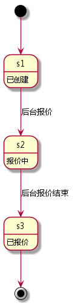

<!-- START doctoc generated TOC please keep comment here to allow auto update -->
<!-- DON'T EDIT THIS SECTION, INSTEAD RE-RUN doctoc TO UPDATE -->
**Table of Contents**  *generated with [DocToc](https://github.com/thlorenz/doctoc)*

- [ChangeLog](#changelog)
- [Data Structure](#data-structure)
  - [quotation](#quotation)
  - [quotation-item](#quotation-item)
  - [quotation-item-pair](#quotation-item-pair)
- [Database](#database)
  - [quotations](#quotations)
  - [quotation_items](#quotation_items)
- [Cache](#cache)
  - [vid-qid](#vid-qid)
  - [quotation-entities](#quotation-entities)
- [API](#api)
  - [createQuotation](#createquotation)
      - [request](#request)
      - [response](#response)
  - [getQuotation](#getquotation)
      - [request](#request-1)
      - [response](#response-1)
  - [getLastQuotationByVid](#getlastquotationbyvid)
      - [request](#request-2)
      - [response](#response-2)
  - [refresh](#refresh)
      - [request](#request-3)
      - [response](#response-3)
  - [getReferenceQuotation](#getreferencequotation)
      - [request](#request-4)
      - [response](#response-4)
  - [getAccurateQuotation](#getaccuratequotation)
      - [request](#request-5)
      - [response](#response-5)

<!-- END doctoc generated TOC please keep comment here to allow auto update -->


# ChangeLog

1. 2017-02-25
  * 删除 getReferenceQuotation 的入参 licenseNumber, modelListOrder
  * 增加 getReferenceQuotation 的入参 vid
  * 删除 getAccurateQuotation 的入参 ownerName, ownerID, ownerMobile, licenseNumber, modelListOrder
  * 增加 getAccurateQuotation 的入参 vid

1. 2017-02-24
  * 增加 license-two-dates 缓存

1. 2017-02-22
  * 增加 qid 和 pgid 到 quotation_items 表

1. 2017-02-18
  * 修改 getAccurateQuotation 的返回结果

1. 2017-02-17
  * 增加 quotation-item-pair 数据结构
  * 删除 quotation-item-price 数据结构
  * 删除 quotation-item-quota 数据结构
  * 删除外部队列

1. 2017-02-10
  * 删除 quotation-group 数据结构
  * 删除后台提醒
  * 删除 quotations 表中 pid 和 fu_total_price
  * quotation_item_list 重命名为 quotation_items 表
  * quotation_items 表中，piid 改为 pid
  * 删除 newMessageNotify 方法

1. 2017-01-16
  * getQuotationByVid 改名为 getLastQuotationByVid

1. 2016-12-17
  * createQuotation 返回的结果增加了创建时间

1. 2016-12-15
  * 删除 vin-qid 索引
  * 删除 createQuotation 中的 vin 参数

1. 2016-12-12
  * 删除 getQuotatedQuotations
  * 删除 getUnquotatedQuotations
  * 删除 getQuotations
  * 删除 getTicket
  * 删除 newMessageNotify
  * 删除 addQuotationGroups
  * 删除 unquotated-quotations 缓存
  * 删除 quotated-quotations 缓存
  * Rename VIN-quotation to vin-qid
  * 删除 quotation\_items
  * 删除 quotation\_item_prices
  * 删除 quotation\_item_prices
  * 增加 quotation\_item_list

1. 2016-12-08
  * 增加 vid-qid 外键
  * 增加 getQuotationByVid
  * 增加 getAccurateQuotation

1. 2016-11-19
  * 增加 toc
  * 增加外部队列

# Data Structure

## quotation

| name               | type             | note            |
| ----               | ----             | ----            |
| id                 | uuid             | 主键            |
| state              | int              | 报价状态        |
| items              | [quotation-item] | 对应计划集合    |
| vehicle            | vehicle          | 对应的车辆      |
| outside_quotation1 | float            | 第三方报价1     |
| outside_quotation2 | float            | 第三方报价2     |
| screenshot1        | string           | 第三方报价截图1 |
| screenshot2        | string           | 第三方报价截图2 |
| total_price        | real             | 总价            |
| insure             | int              | 保险公司        |
| auto               | int              | 是否是自动报价  |

报价的 ID 与 vehicle 的 ID 是一致的。

[](报价状态转换图)

## quotation-item

| name  | type                  | note           |
| ----  | ----                  | ----           |
| id    | uuid                  | 主键           |
| plan  | plan                  | 对应的 plan    |
| pairs | [quotation-item-pair] | 限价与价格组合 |

## quotation-item-pair

| name       | type   | note     |
| ----       | ----   | ----     |
| price      | float  | 原价     |
| real-price | float  | 真实价格 |
| amount     | float  | 数量     |
| unit       | string | 单位     |

# Database

## quotations

| field              | type          | null | default | index   | reference |
| ----               | ----          | ---- | ----    | ----    | ----      |
| id                 | uuid          |      |         | primary |           |
| vid                | uuid          |      |         |         | vehicles  |
| state              | int           |      | 0       |         |           |
| created_at         | timestamp     |      | now     |         |           |
| updated_at         | timestamp     |      | now     |         |           |
| outside_quotation1 | real          |      | 0.0     |         |           |
| outside_quotation2 | real          |      | 0.0     |         |           |
| screenshot1        | varchar(1024) | ✓    |         |         |           |
| screenshot2        | varchar(1024) | ✓    |         |         |           |
| total_price        | real          |      |         |         |           |
| insure             | smallint      |      |         |         |           |
| auto               | smallint      |      |         |         |           |

## quotation_items

| field      | type         | null | default | index   | reference   |
| ----       | ----         | ---- | ----    | ----    | ----        |
| id         | uuid         |      |         | primary |             |
| qid        | uuid         |      |         |         | quotations  |
| pid        | integer      |      |         |         | plans       |
| pgid       | uuid         | ✓    |         |         | plan-groups |
| price      | real         |      |         |         |             |
| num        | real         |      |         |         |             |
| unit       | varhchar(16) |      |         |         |             |
| real_price | real         |      |         |         |             |
| type       | smallint     |      |         |         |             |
| insure     | smallint     |      |         |         |             |
| created_at | timestamp    |      | now     |         |             |
| updated_at | timestamp    |      | now     |         |             |

其中，type 字段用于处理多个价格的情况，比如：["三块漆", "六块漆"]

# Cache

## vid-qid

| key     | type | value      | note                     |
| ----    | ---- | ----       | ----                     |
| vid-qid | hash | vid => qid | vehicle与quotation的外键 |

## quotation-entities

| key                | type | value            | note         |
| ----               | ---- | ----             | ----         |
| quotation-entities | hash | qid => quotation | 所有报价实体 |

## license-two-dates
| key                | type | value            | note         |
| ----               | ---- | ----             | ----         |
| license-two-dates | hash | license => two-date | 商业险和车险起期 |

# API

## createQuotation

创建报价

| domain | accessable |
| ----   | ----       |
| admin  | ✓          |
| mobile | ✓          |

#### request

| name | type | note    |
| ---- | ---- | ----    |
| vid  | uuid | 车辆 ID |

```javascript
let vid = "00000000-0000-0000-0000-000000000000";

rpc.call("quotation", "createQuotation", vid)
  .then(function (result) {

  }, function (error) {

  });

```

#### response

成功：

| name | type   | note |
| ---- | ----   | ---- |
| code | int    | 200  |
| data | object | 见下 |

data 的定义

| name        | type | note     |
| ----        | ---- | ----     |
| qid         | uuid | 报价ID   |
| created\_at | date | 创建时间 |

失败：

| name | type   | note |
| ---- | ----   | ---- |
| code | int    |      |
| msg  | string |      |

| code | meanning |
| ---- | ----     |
| 408  | 请求超时 |
| 500  | 未知错误 |

See [example](../data/quotation/createQuotation.json)

## getQuotation

获取某个报价

| domain | accessable |
| ----   | ----       |
| admin  | ✓          |
| mobile | ✓          |

#### request

| name           | type    | note     |
| ----           | ----    | ----     |
| qid            | uuid    | 报价 ID  |

```javascript

let qid = "00000000-0000-0000-0000-000000000000";
rpc.call("quotation", "getQuotation", qid)
  .then(function (result) {

  }, function (error) {

  });

```

#### response

成功：

| name | type      | note     |
| ---- | ----      | ----     |
| code | int       | 200      |
| data | quotation | 报价内容 |

失败：

| name | type   | note |
| ---- | ----   | ---- |
| code | int    |      |
| msg  | string |      |

| code | meanning |
| ---- | ----     |
| 408  | 请求超时 |
| 500  | 未知错误 |

See [example](../data/quotation/getQuotation.json)

## getLastQuotationByVid

通过vid获取最后一次报价

| domain | accessable |
| ----   | ----       |
| admin  | ✓          |
| mobile | ✓          |

#### request

| name | type | note       |
| ---- | ---- | ----       |
| vid  | uuid | vehicle ID |

```javascript

let vid = "00000000-0000-0000-0000-000000000000";
rpc.call("quotation", "getLastQuotationByVid", vid)
  .then(function (result) {

  }, function (error) {

  });

```

#### response

成功：

| name | type      | note     |
| ---- | ----      | ----     |
| code | int       | 200      |
| data | quotation | 报价内容 |

失败：

| name | type   | note |
| ---- | ----   | ---- |
| code | int    |      |
| msg  | string |      |

| code | meanning   |
| ---- | ----       |
| 404  | 报价不存在 |
| 408  | 请求超时   |
| 500  | 未知错误   |

See [example](../data/quotation/getQuotation.json)

## refresh

刷新报价缓存

| domain | accessable |
| ----   | ----       |
| admin  | ✓          |
| mobile |            |

#### request

| name | type | note           |
| ---- | ---- | ----           |
| qid  | uuid | 报价 ID (可选) |

Example

```javascript

rpc.call("quotation", "refresh")
  .then(function (result) {

  }, function (error) {

  });
```
#### response

| name | type   | note     |
| ---- | ----   | ----     |
| code | int    | 结果编码 |
| msg  | string | 结果内容 |

| code  | msg      | meaning |
| ----  | ----     | ----    |
| 200   | null     | 成功    |
| other | 错误信息 | 失败    |

## getReferenceQuotation

通过车辆信息获取参考报价的商业险起期与交强险起期

#### request

| name           | type      | note                        |
| ----           | ----      | ----                        |
| vid  | string | vehicle id            |
| cityCode  | string | 行驶城市代码            |
| insurerCode  | string | 保险人代码            |

```javascript

let vid = "00000000-0000-0000-0000-000000000000";

rpc.call("quotation", "getReferenceQuotation", vid)
  .then(function (result) {

  }, function (error) {

  });

```

#### response

成功：

| name | type | note |
| ---- | ---- | ---- |
| code | int  | 200  |
| data | JSON | 见下 |

data 字段解释

| name        | type       | note                  |
| ----        | ----       | ----                  |
| biBeginDate | String(20) | 商业险起期 2016-09-01 |
| ciBeginDate | String(20) | 交强险起期 2016-09-01 |

data 例：

```
{
    "biBeginDate": "2017-01-11",
    "ciBeginDate": "2017-01-11"
}
```

失败：

| name | type   | note |
| ---- | ----   | ---- |
| code | int    |      |
| msg  | string |      |

| code | meanning             |
| ---- | ----                 |
| 400  | 具体内容见返回的 msg |
| 408  | 请求超时             |
| 500  | 未知错误             |

错误例：
```
{
    "code":400,
    "msg":"商业险起保日期(2016-12-15)距今超过90天"
}
```

## getAccurateQuotation

通过车辆信息获取精准报价

#### request

| name           | type       | note                            |
| ----           | ----       | ----                            |
| vid  | string | vehicle id            |
| cityCode  | string | 行驶城市代码            |
| insurerCode  | string | 保险人代码            |

固定的参数，不用再传

| name        | type        | note                                                  |
| ----        | ----        | ----                                                  |
| isTrans     | String(2)   | 是否过户车 0 否,1 是,固定为 "0"                       |
| transDate   | String(20)  | 过户日期 null 或 2017-09-01，固定为 null              |
| cityCode    | String(6)   | 行驶城市代码 国标码,到二级城市, 固定为 "110100"，北京 |
| insurerCode | String(100) | 固定为 "ASTP"，永城保险公司                           |


```javascript

let vid = "00000000-0000-0000-0000-000000000000";

rpc.call("quotation", "getAccurateQuotation", vid)
  .then(function (result) {

  }, function (error) {

  });

```

#### response

成功：

| name | type      | note     |
| ---- | ----      | ----     |
| code | int       | 200      |
| data | quotation | 报价内容 |

失败：

| name | type   | note |
| ---- | ----   | ---- |
| code | int    |      |
| msg  | string |      |

| code | meanning             |
| ---- | ----                 |
| 400  | 具体内容见返回的 msg |
| 408  | 请求超时             |
| 500  | 未知错误             |

See [example](../data/quotation/getQuotation.json)
