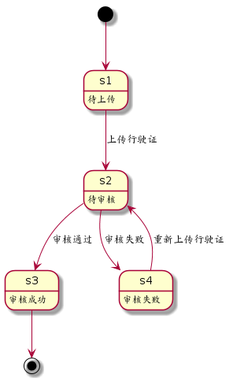

<!-- START doctoc generated TOC please keep comment here to allow auto update -->
<!-- DON'T EDIT THIS SECTION, INSTEAD RE-RUN doctoc TO UPDATE -->
**Table of Contents**  *generated with [DocToc](https://github.com/thlorenz/doctoc)*

- [ChangeLog](#changelog)
- [Data Structure](#data-structure)
  - [quotation](#quotation)
  - [quotation-item](#quotation-item)
  - [quotation-item-pair](#quotation-item-pair)
- [Database](#database)
  - [quotations](#quotations)
  - [quotation_items](#quotation_items)
- [Cache](#cache)
  - [vid-uid:qid](#vid-uidqid)
  - [uid-vids](#uid-vids)
  - [quotation-entities](#quotation-entities)
  - [quotation-slim-entities](#quotation-slim-entities)
  - [license-two-dates](#license-two-dates)
  - [zt-quotation:${vid}:${insurer_code}](#zt-quotationvidinsurer_code)
- [API](#api)
  - [createAgentQuotation](#createagentquotation)
      - [request](#request)
      - [Item](#item)
      - [response](#response)
  - [createQuotation](#createquotation)
      - [request](#request-1)
      - [response](#response-1)
  - [getQuotation](#getquotation)
      - [request](#request-2)
      - [response](#response-2)
  - [refresh](#refresh)
      - [request](#request-3)
      - [response](#response-3)
  - [getReferenceQuotation](#getreferencequotation)
      - [request](#request-4)
      - [response](#response-4)
  - [getAccurateQuotation](#getaccuratequotation)
      - [request](#request-5)
      - [response](#response-5)
  - [getLastQuotations](#getlastquotations)
      - [request](#request-6)
      - [response](#response-6)
  - [getQuotationByVehicle](#getquotationbyvehicle)
      - [request](#request-7)
      - [response](#response-7)
  - [cancelQuotations](#cancelquotations)
      - [request](#request-8)
      - [response](#response-8)
  - [updateDrivingView](#updatedrivingview)
      - [request](#request-9)
      - [response](#response-9)
  - [getOwnerByVehicle](#getownerbyvehicle)
      - [request](#request-10)
      - [response](#response-10)

<!-- END doctoc generated TOC please keep comment here to allow auto update -->


# ChangeLog

1. 2017-05-09
  * 重命名缓存 vid:uid-qid 为 vid-uid:qid
  * 重命名 driving-view-verified 为 driving-view-verify-state

1. 2017-05-08
  * 增加 driving-view
  * 增加 driving-view-verified
  * 增加 driving-view-refused-reason
  * 增加 getQuotationByVehicle 接口
  * 增加 cancelQuotations 接口
  * 增加 updateDrivingView 接口
  * 增加 getOwnerByVehicle 接口
  * 修改 createQuotation 接口

1. 2017-04-22
  * 增加 discount 到 quotation 数据结构
  * 增加 discount 到 quotations 表
  * 增加 discount 到 createQuotation 接口

1. 2017-04-21
  * 删除 getLastQuotationByVid 接口

1. 2017-04-20
  * 增加 real_value 和 price 到 createAgentQuotation

1. 2017-04-17
  * 增加 inviter 到 quotation 数据结构
  * 增加 inviter 到 quotations 数据表

1. 2017-04-08
  * 增加 createAgentQuotation 接口

1. 2017-04-02
  * 增加 getAccurateQuotation 入参 flag

1. 2017-03-21
  * 修改 缓存 vid-qid 为 vid:uid-qid

1. 2017-03-20
  * 修改 缓存 uid-vids 为 vids:${uid}
  * 增加 getAccurateQuotation 入参 save

1. 2017-03-18
  * 增加 getLastQuotations 方法
  * 增加 uid-vids 缓存
  * 增加 quotation-entities-slim 缓存

1. 2017-03-17
  * 增加 createQuotation 入参 recommend
  * 增加 quotation, quotations 字段 recommend

1. 2017-03-16
  * 修改 zt-quotation:${vid} 为 zt-quotation:${vid}:${insurer_code}
  * 增加 getAccurateQuotation 入参 cache_first

1. 2017-03-15
  * 增加 owner 到 quotations 表
  * 增加 insured 到 quotations 表
  * 增加 getReferenceQuotation 入参 owner, insured
  * 增加 createQuotation 入参 owner, insured
  * 增加 getAccurateQuotation 入参 owner, insured, bi_begin_date, ci_bigin_date
  * 修改 getReferenceQuotation 的出参
 
1. 2017-03-14
  * 增加 uid 到 quotations 表

1. 2017-03-13
  * 增加 getAccurateQuotation 的入参 qid 

1. 2017-03-05
  * 增加 quotations 字段 insure 的说明
  * 删除 quotation-items 的字段 pgid

1. 2017-03-06
  * 重命名 quotation_items 表的 num 字段为 amount

1. 2017-03-05
  * 增加 quotations 的字段 promotion
  * 增加 real_value 字段到 quotations 表
  * 修改 quotations 表中的 total_price 字段为 price

1. 2017-02-28
  * 修正 quotation_items 的 type 字段类型为 varchar(16)
  * 增加 type 到 quotation-item
  * 增加 zt-quotation:${vid} 缓存

1. 2017-02-27
  * 修改 getAccurateQuotation 的固定参数说明
  * 修改 getReferenceQuotation 和 getAccurateQuotation　的示例

1. 2017-02-25
  * 增加 createQuotation 的可选入参 qid

1. 2017-02-25
  * 删除 getReferenceQuotation 的入参 licenseNumber, modelListOrder
  * 增加 getReferenceQuotation 的入参 vid
  * 删除 getAccurateQuotation 的入参 ownerName, ownerID, ownerMobile, licenseNumber, modelListOrder
  * 增加 getAccurateQuotation 的入参 vid

1. 2017-02-24
  * 增加 license-two-dates 缓存

1. 2017-02-22
  * 增加 qid 和 pgid 到 quotation_items 表

1. 2017-02-18
  * 修改 getAccurateQuotation 的返回结果

1. 2017-02-17
  * 增加 quotation-item-pair 数据结构
  * 删除 quotation-item-price 数据结构
  * 删除 quotation-item-quota 数据结构
  * 删除外部队列

1. 2017-02-10
  * 删除 quotation-group 数据结构
  * 删除后台提醒
  * 删除 quotations 表中 pid 和 fu_total_price
  * quotation_item_list 重命名为 quotation_items 表
  * quotation_items 表中，piid 改为 pid
  * 删除 newMessageNotify 方法

1. 2017-01-16
  * getQuotationByVid 改名为 getLastQuotationByVid

1. 2016-12-17
  * createQuotation 返回的结果增加了创建时间

1. 2016-12-15
  * 删除 vin-qid 索引
  * 删除 createQuotation 中的 vin 参数

1. 2016-12-12
  * 删除 getQuotatedQuotations
  * 删除 getUnquotatedQuotations
  * 删除 getQuotations
  * 删除 getTicket
  * 删除 newMessageNotify
  * 删除 addQuotationGroups
  * 删除 unquotated-quotations 缓存
  * 删除 quotated-quotations 缓存
  * Rename VIN-quotation to vin-qid
  * 删除 quotation_items
  * 删除 quotation_item_prices
  * 删除 quotation_item_prices
  * 增加 quotation_item_list

1. 2016-12-08
  * 增加 vid-qid 外键
  * 增加 getQuotationByVid
  * 增加 getAccurateQuotation

1. 2016-11-19
  * 增加 toc
  * 增加外部队列

# Data Structure

## quotation

| name                        | type             | note                   |
| ----                        | ----             | ----                   |
| id                          | uuid             | 主键                   |
| uid                         | uuid             | user ID                |
| state                       | int              | 报价状态               |
| items                       | [quotation-item] | 对应计划集合           |
| vehicle                     | vehicle          | 对应的车辆             |
| owner                       | person           | 对应的车主             |
| insured                     | person           | 对应的投保人           |
| recommend                   | string           | 对应的推荐人           |
| inviter                     | string           | 对应的邀请人           |
| outside-quotation1          | float            | 第三方报价1            |
| outside-quotation2          | float            | 第三方报价2            |
| screenshot1                 | string           | 第三方报价截图1        |
| screenshot2                 | string           | 第三方报价截图2        |
| price                       | real             | 总价                   |
| real-value                  | real             | 车辆实际价值           |
| promotion                   | real             | 优惠金额               |
| discount                    | real             | 优惠折扣               |
| insure                      | int              | 保险公司               |
| auto                        | int              | 是否是自动报价         |
| driving-view                | string           | 行驶证照片地址         |
| driving-view-verify-state   | int              | 行驶证审核状态         |
| driving-view-refused-reason | string           | 行驶证未通过审核的原因 |

注意，promotion 是金额，discount 是比例

| insure | meaning        |
| ----   | ----           |
| 1      | 安盛天平(ASTP) |
| 2      | 人保(PICC)     |
| 3      | 永诚(APIC)     |
| 4      | 国寿财(CLPC)   |
| 5      | 利宝(LIHI)     |


[](报价状态转换图)

[](行驶证审核状态转换图)

## quotation-item

| name  | type                  | note           |
| ----  | ----                  | ----           |
| id    | uuid                  | 主键           |
| plan  | plan                  | 对应的 plan    |
| pairs | [quotation-item-pair] | 限价与价格组合 |

## quotation-item-pair

| name       | type   | note                                               |
| ----       | ----   | ----                                               |
| price      | float  | 原价                                               |
| real-price | float  | 真实价格                                           |
| amount     | float  | 数量                                               |
| unit       | string | 单位                                               |
| type       | int    | 用于处理多个价格的情况，比如：["三块漆", "六块漆"] |

# Database

## quotations

| field                       | type          | null | default | index   | reference |
| ----                        | ----          | ---- | ----    | ----    | ----      |
| id                          | uuid          |      |         | primary |           |
| uid                         | uuid          |      |         |         | users     |
| vid                         | uuid          |      |         |         | vehicles  |
| owner                       | uuid          |      |         |         | person    |
| insured                     | uuid          |      |         |         | person    |
| recommend                   | varchar(100)  | ✓    |         |         |           |
| inviter                     | varchar(16)   | ✓    |         |         |           |
| state                       | int           |      | 0       |         |           |
| created_at                  | timestamp     |      | now     |         |           |
| updated_at                  | timestamp     |      | now     |         |           |
| outside_quotation1          | numeric(10,2) |      | 0.0     |         |           |
| outside_quotation2          | numeric(10,2) |      | 0.0     |         |           |
| screenshot1                 | varchar(1024) | ✓    |         |         |           |
| screenshot2                 | varchar(1024) | ✓    |         |         |           |
| price                       | real          |      | 0.0     |         |           |
| real_value                  | real          |      | 0.0     |         |           |
| promotion                   | real          |      | 0.0     |         |           |
| discount                    | real          |      | 1.0     |         |           |
| insure                      | smallint      |      |         |         |           |
| auto                        | smallint      |      |         |         |           |
| driving_view                | varchar(1024) | ✓    |         |         |           |
| driving_view_verify_state   | smallint      | ✓    | 1       |         |           |
| driving_view_refused_reason | varchar(128)  | ✓    |         |         |           |


## quotation_items

| field      | type          | null | default | index   | reference  |
| ----       | ----          | ---- | ----    | ----    | ----       |
| id         | uuid          |      |         | primary |            |
| qid        | uuid          |      |         |         | quotations |
| pid        | integer       |      |         |         | plans      |
| price      | numeric(10,2) |      |         |         |            |
| amount     | numeric(10,2) |      |         |         |            |
| unit       | varchar(16)   |      |         |         |            |
| real_price | real          |      |         |         |            |
| type       | smallint      |      |         |         |            |
| insure     | smallint      |      |         |         |            |
| created_at | timestamp     |      | now     |         |            |
| updated_at | timestamp     |      | now     |         |            |

其中，type 字段用于处理多个价格的情况，比如：["三块漆", "六块漆"]

# Cache

## vid-uid:qid

| key         | type | value          | note                     |
| ----        | ---- | ----           | ----                     |
| vid-uid:qid | hash | vid:uid => qid | vehicle与quotation的外键 |

## uid-vids

| key         | type | value | note                |
| ----        | ---- | ----  | ----                |
| vids:${uid} | set  | [vid] | user与vehicle的外键 |

## quotation-entities

| key                | type | value            | note         |
| ----               | ---- | ----             | ----         |
| quotation-entities | hash | qid => quotation | 所有报价实体 |


## quotation-slim-entities

| key                | type | value            | note         |
| ----               | ---- | ----             | ----         |
| quotation-slim-entities | hash | qid => quotation-slim | 报价 slim |

## license-two-dates

| key               | type | value               | note             |
| ----              | ---- | ----                | ----             |
| license-two-dates | hash | license => two-date | 商业险和车险起期 |

## zt-quotation:${vid}:${insurer_code}

| key                                 | type   | value            | note                     |
| ----                                | ----   | ----             | ----                     |
| zt-quotation:${vid}:${insurer_code} | string | zt response data | 智通响应数据(30天有效期) |

# API

## createAgentQuotation

创建报价

| domain | accessable |
| ----   | ----       |
| admin  | ✓          |
| mobile | ✓          |

#### request

| name       | type   | note         |
| ----       | ----   | ----         |
| vid        | uuid   | 车辆 ID      |
| owner      | uuid   | 车主 ID      |
| insured    | uuid   | 投保人ID     |
| recommend  | string | 推荐人       |
| inviter    | string | 邀请人       |
| items      | [Item] | 报价条目     |
| real_value | number | 车辆真实价值 |
| price      | number | 总价         |
| qid?       | uuid   | quotation ID |

#### Item

| name       | type   | note                                             |
| ----       | ----   | ----                                             |
| pid        | uuid   | 对应的 plan ID                                   |
| price      | float  | 原价                                             |
| amount     | float  | 数量                                             |
| unit       | string | 单位                                             |
| real_price | float  | 真实价格                                         |
| type       | int    | 用于处理多个价格的情况, 比如["三块漆", "六块漆"] |
| insure     | int    | 保险公司                                         |

```javascript
// 手工报价

const vid        = "00000000-0000-0000-0000-000000000000";
const owner      = "00000000-0000-0000-0000-000000000000";
const insured    = "00000000-0000-0000-0000-000000000000";
const recommend  = "";
const items      = [];
const real_value = 0;
const price      = 0;

rpc.call("quotation", "createAgentQuotation", vid, owner, insured, recommend, inviter, items, real_value, price)
  .then(function (result) {

  }, function (error) {

  });

// 自动报价，前端忽略
const vid        = "00000000-0000-0000-0000-000000000000";
const owner      = "00000000-0000-0000-0000-000000000000";
const insured    = "00000000-0000-0000-0000-000000000000";
const recommend  = "";
const inviter    = "";
const items      = [];
const real_value = 0;
const price      = 0;
const qid        = "00000000-0000-0000-0000-000000000000";

rpc.call("quotation", "createAgentQuotation", vid, owner, insured, recommend, inviter, items, real_value, price, qid)
  .then(function (result) {

  }, function (error) {

  });

```

#### response

成功：

| name | type   | note |
| ---- | ----   | ---- |
| code | int    | 200  |
| data | object | 见下 |

data 的定义

| name       | type | note     |
| ----       | ---- | ----     |
| qid        | uuid | 报价ID   |
| created_at | date | 创建时间 |

失败：

| name | type   | note |
| ---- | ----   | ---- |
| code | int    |      |
| msg  | string |      |

| code | meanning |
| ---- | ----     |
| 408  | 请求超时 |
| 500  | 未知错误 |


## createQuotation

创建报价

| domain | accessable |
| ----   | ----       |
| admin  | ✓          |
| mobile | ✓          |

#### request

| name          | type   | note         |
| ----          | ----   | ----         |
| vid           | uuid   | 车辆 ID      |
| owner         | uuid   | 车主 ID      |
| insured       | uuid   | 投保人ID     |
| discount      | number | 推荐折扣     |
| recommend?    | string | 推荐人       |
| driving_view? | string | 行驶证地址   |
| qid?          | uuid   | quotation ID |

```javascript
// 手工报价
const vid          = "00000000-0000-0000-0000-000000000000";
const owner        = "00000000-0000-0000-0000-000000000000";
const insured      = "00000000-0000-0000-0000-000000000000";
const recommend    = "";
const driving_view = "";

rpc.call("quotation", "createQuotation", vid, owner, insured, discount, recommend, driving_view)
  .then(function (result) {

  }, function (error) {

  });

// 自动报价，前端忽略

const vid          = "00000000-0000-0000-0000-000000000000";
const owner        = "00000000-0000-0000-0000-000000000000";
const insured      = "00000000-0000-0000-0000-000000000000";
const recommend    = "";
const discount     = 1.0;
const driving_view = "";
const qid          = "00000000-0000-0000-0000-000000000000";

rpc.call("quotation", "createQuotation", vid, owner, insured, discount, recommend, driving_view, qid)
  .then(function (result) {

  }, function (error) {

  });

```

#### response

成功：

| name | type   | note |
| ---- | ----   | ---- |
| code | int    | 200  |
| data | object | 见下 |

data 的定义

| name       | type | note     |
| ----       | ---- | ----     |
| qid        | uuid | 报价ID   |
| created_at | date | 创建时间 |

失败：

| name | type   | note |
| ---- | ----   | ---- |
| code | int    |      |
| msg  | string |      |

| code | meanning |
| ---- | ----     |
| 408  | 请求超时 |
| 500  | 未知错误 |

See [example](../data/quotation/createQuotation.json)

## getQuotation

获取某个报价

| domain | accessable |
| ----   | ----       |
| admin  | ✓          |
| mobile | ✓          |

#### request

| name | type | note    |
| ---- | ---- | ----    |
| qid  | uuid | 报价 ID |

```javascript

let qid = "00000000-0000-0000-0000-000000000000";
rpc.call("quotation", "getQuotation", qid)
  .then(function (result) {

  }, function (error) {

  });

```

#### response

成功：

| name | type      | note     |
| ---- | ----      | ----     |
| code | int       | 200      |
| data | quotation | 报价内容 |

失败：

| name | type   | note |
| ---- | ----   | ---- |
| code | int    |      |
| msg  | string |      |

| code | meanning |
| ---- | ----     |
| 408  | 请求超时 |
| 500  | 未知错误 |

See [example](../data/quotation/getQuotation.json)

## refresh

刷新报价缓存

| domain | accessable |
| ----   | ----       |
| admin  | ✓          |
| mobile |            |

#### request

| name | type | note           |
| ---- | ---- | ----           |
| qid  | uuid | 报价 ID (可选) |

Example

```javascript

rpc.call("quotation", "refresh")
  .then(function (result) {

  }, function (error) {

  });
```
#### response

| name | type   | note     |
| ---- | ----   | ----     |
| code | int    | 结果编码 |
| msg  | string | 结果内容 |

| code  | msg      | meaning |
| ----  | ----     | ----    |
| 200   | null     | 成功    |
| other | 错误信息 | 失败    |

## getReferenceQuotation

通过车辆信息获取参考报价的商业险起期与交强险起期

#### request

| name         | type   | note         |
| ----         | ----   | ----         |
| vid          | string | vehicle id   |
| owner        | uuid   | 车主 ID      |
| insured      | uuid   | 投保人ID     |
| city_code    | string | 行驶城市代码 |
| insurer_code | string | 保险人代码   |

```javascript

let vid          = "00000000-0000-0000-0000-000000000000";
let owner        = "00000000-0000-0000-0000-000000000000";
let insured      = "00000000-0000-0000-0000-000000000000";
let city_code    = "110100"; // 北京
let insurer_code = "APIC"; // 永诚

rpc.call("quotation", "getReferenceQuotation", vid, owner, insured, city_code, insurer_code)
  .then(function (result) {

  }, function (error) {

  });

```

#### response

成功：

| name | type | note |
| ---- | ---- | ---- |
| code | int  | 200  |
| data | JSON | 见下 |

data 字段解释

| name          | type       | note                  |
| ----          | ----       | ----                  |
| bi_begin_date | String(20) | 商业险起期 2016-09-01 |
| ci_begin_date | String(20) | 交强险起期 2016-09-01 |

data 例：

```
{
    "bi_begin_date": "2017-01-11",
    "ci_begin_date": "2017-01-11"
}
```

失败：

| name | type   | note |
| ---- | ----   | ---- |
| code | int    |      |
| msg  | string |      |

| code | meanning             |
| ---- | ----                 |
| 400  | 具体内容见返回的 msg |
| 408  | 请求超时             |
| 500  | 未知错误             |

错误例：
```
{
    "code":400,
    "msg":"商业险起保日期(2016-12-15)距今超过90天"
}
```

## getAccurateQuotation

通过车辆信息获取精准报价

#### request

| name          | type    | note                                 |
| ----          | ----    | ----                                 |
| vid           | string  | vehicle id                           |
| qid           | string  | quotation id                         |
| owner         | uuid    | 车主 ID                              |
| insured       | uuid    | 投保人ID                             |
| city_code     | string  | 行驶城市代码                         |
| insurer_code  | string  | 保险人代码                           |
| bi_begin_date | Date    | 商业险起期                           |
| ci_begin_date | Date    | 交强险起期                           |
| flag          | number  | 玻璃单独破碎险： 1 是国产， 2 是进口 |
| cache_first   | boolean | 是否优先从缓存获取                   |
| save          | boolean | 是否存库                             |

固定的参数

| name         | type        | note                                             |
| ----         | ----        | ----                                             |
| city_code    | String(6)   | 行驶城市代码 国标码,到二级城市, 北京(传"110100") |
| insurer_code | String(100) | 永诚保险公司(传"APIC")                           |


```javascript

let vid             = "00000000-0000-0000-0000-000000000000";
let qid             = "00000000-0000-0000-0000-000000000000";
let owner           = "00000000-0000-0000-0000-000000000000";
let insured         = "00000000-0000-0000-0000-000000000000";
let city_code      = "110100";
let insurer_code   = "APIC";
let bi_begin_date = new Date("20170315");
let ci_begin_date = new Date("20170315");
let flag           = 1;
let cache_first    = false;
let save            = false;

rpc.call("quotation", "getAccurateQuotation", vid, qid, owner, insured, city_code, insurer_code, bi_begin_date, ci_begin_date, flag, cache_first)
  .then(function (result) {

  }, function (error) {

  });

```

#### response

成功：

| name | type      | note     |
| ---- | ----      | ----     |
| code | int       | 200      |
| data | quotation | 报价内容 |

失败：

| name | type   | note |
| ---- | ----   | ---- |
| code | int    |      |
| msg  | string |      |

| code | meanning             |
| ---- | ----                 |
| 400  | 具体内容见返回的 msg |
| 408  | 请求超时             |
| 500  | 未知错误             |

See [example](../data/quotation/getQuotation.json)

## getLastQuotations

得到用户最后一次的报价，流程如下：

1. 获得用户名下的所有车辆;

2. 遍历所有车辆，得到最后一次的报价。

| domain | accessable |
| ----   | ----       |
| admin  |            |
| mobile | ✓          |

#### request

| name  | type    | note               |
| ----  | ----    | ----               |
| full? | boolean | 是否完整版, 默认否 |

#### response

成功：

| name | type        | note |
| ---- | ----        | ---- |
| code | int         | 200  |
| data | [quotation] |      |

失败：

| name | type   | note |
| ---- | ----   | ---- |
| code | int    |      |
| msg  | string |      |

| code | meanning |
| ---- | ----     |
| 500  | 未知错误 |

## getQuotationByVehicle

根据车辆信息得到报价

| domain | accessable |
| ----   | ----       |
| admin  |            |
| mobile | ✓          |

#### request

| name | type | note   |
| ---- | ---- | ----   |
| vid  | uuid | 车辆ID |

#### response

成功：

| name | type      | note |
| ---- | ----      | ---- |
| code | int       | 200  |
| data | quotation |      |

See [example](../data/quotation/getQuotationByVehicle.json)

失败：

| name | type   | note |
| ---- | ----   | ---- |
| code | int    |      |
| msg  | string |      |

| code | meanning       |
| ---- | ----           |
| 403  | 跨用户获取报价 |
| 500  | 未知错误       |

## cancelQuotations

批量取消报价

| domain | accessable |
| ----   | ----       |
| admin  |            |
| mobile | ✓          |

#### request

| name | type   | note     |
| ---- | ----   | ----     |
| qids | [uuid] | 报价编号 |

#### response

成功：

| name | type   | note   |
| ---- | ----   | ----   |
| code | int    | 200    |
| data | string | "Okay" |

失败：

| name | type   | note |
| ---- | ----   | ---- |
| code | int    |      |
| msg  | string |      |

| code | meanning       |
| ---- | ----           |
| 403  | 跨用户取消报价 |
| 500  | 未知错误       |

## updateDrivingView

更新行驶证信息

| domain | accessable |
| ----   | ----       |
| admin  |            |
| mobile | ✓          |

#### request

| name         | type   | note       |
| ----         | ----   | ----       |
| qid          | uuid   | 报价编号   |
| driving_view | string | 行驶证地址 |

#### response

成功：

| name | type   | note   |
| ---- | ----   | ----   |
| code | int    | 200    |
| data | string | "Okay" |

失败：

| name | type   | note |
| ---- | ----   | ---- |
| code | int    |      |
| msg  | string |      |

| code | meanning         |
| ---- | ----             |
| 403  | 跨用户更新行驶证 |
| 500  | 未知错误         |

## getOwnerByVehicle

获取车主信息

| domain | accessable |
| ----   | ----       |
| admin  |            |
| mobile | ✓          |

#### request

| name | type | note     |
| ---- | ---- | ----     |
| vid  | uuid | 车辆编号 |

#### response

成功：

| name | type   | note |
| ---- | ----   | ---- |
| code | int    | 200  |
| data | person | 车主 |

失败：

| name | type   | note |
| ---- | ----   | ---- |
| code | int    |      |
| msg  | string |      |

| code | meanning         |
| ---- | ----             |
| 403  | 跨用户获取车主信息 |
| 500  | 未知错误         |
