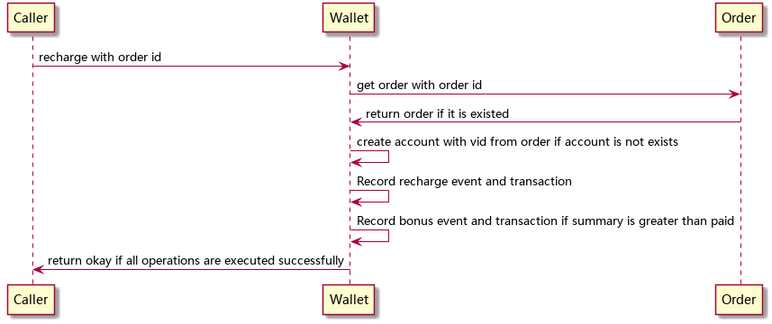

<!-- START doctoc generated TOC please keep comment here to allow auto update -->
<!-- DON'T EDIT THIS SECTION, INSTEAD RE-RUN doctoc TO UPDATE -->
**Table of Contents**  *generated with [DocToc](https://github.com/thlorenz/doctoc)*

- [ChangeLog](#changelog)
- [Data Structure](#data-structure)
  - [Wallet](#wallet)
  - [Account](#account)
  - [Transaction](#transaction)
    - [Transaction Title](#transaction-title)
- [Event](#event)
  - [AccountEvent](#accountevent)
    - [Event Data Structure](#event-data-structure)
    - [Event Type](#event-type)
    - [Event Type And Data Structure Matrix](#event-type-and-data-structure-matrix)
- [Database](#database)
  - [accounts](#accounts)
  - [account_events](#account_events)
  - [transactions](#transactions)
  - [apportions](#apportions)
- [Cache](#cache)
- [API](#api)
  - [getWallet](#getwallet)
      - [request](#request)
      - [response](#response)
  - [recharge](#recharge)
      - [request](#request-1)
      - [response](#response-1)
  - [adjust](#adjust)
      - [request](#request-2)
      - [response](#response-2)
  - [freeze](#freeze)
      - [request](#request-3)
      - [response](#response-3)
  - [unfreeze](#unfreeze)
      - [request](#request-4)
      - [response](#response-4)
  - [deduct](#deduct)
      - [request](#request-5)
      - [response](#response-5)
  - [getTransactions](#gettransactions)
      - [request](#request-6)
      - [response](#response-6)

<!-- END doctoc generated TOC please keep comment here to allow auto update -->

# ChangeLog

1. 2017-03-05
  * 增加 uid 到 transactions 表
  * 删除 accounts 表中的 balance0 字段
  * 增加 frozen_balance0 (小池冻结余额)到 accounts 表
  * 增加 frozen_balance1 (大池冻结余额)到 accounts 表
  * 增加 cashable_balance (可提现余额)到 accounts 表
  * 删除 wallets 表
  * 删除 cashin 方法
  * 删除 cashout 方法
  * 增加 AccountEvent
  * 增加 adjust 方法
  * 增加 wallet-slim-entities 缓存

1. 2017-02-22
  * deduct 方法增加 aid 参数

1. 2017-02-21
  * 删除 WalletEvent
  * 删除 wallet_events 表
  * 删除 account 里的 plan 属性
  * 删除 createWallet 方法
  * 删除 createAccount 方法
  * 重命名 debit 方法为 deduct
  * 删除 updateAccountBalance 方法

1. 2016-12-30
  * account 去掉 type
  * 增加 createWallet
  * 增加 recharge
  * 增加 freeze
  * 增加 unfreeze
  * 增加 debit
  * 增加 cashin
  * 增加 cashout
  * 增加 apportions 表

1. 2016-12-28
  * 增加了解冻交易类型
  * 调整 createAccount 接口参数
  * 调整 updateAccountBalance 接口参数

1. 2016-12-21
  * 删除 cashout 方法

1. 2016-12-10
  * 增加 wallets 表
  * 增加 wallet_events 表
  * 增加 WalletEvent 设计

1. 2016-11-25
  * 增加提现对象

1. 2016-09-24
  * 增加 createAccount 接口。

1. 2016-09-23
  * 调整数据结构
  * 删除 getAccounts 接口。
  * 修改 getWallet 接口的参数。
  * 修改 getTransactions 接口的参数。
  * 修改 getWallet 返回的结果。
  * 修改 getTransactions 返回的结果。
  * 删除 wallet 表。
  * 增加缓存设计。

# Data Structure

## Wallet

| name     | type      | note       |
| ----     | ----      | ----       |
| frozen   | float     | 冻结金额   |
| cashable | float     | 可提现金额 |
| balance  | float     | 总余额     |
| accounts | [account] | 帐号       |

## Account

| name             | type    | note         |
| ----             | ----    | ----         |
| id               | uuid    | 帐号 ID      |
| vehicle          | vehicle | 帐号对应车辆 |
| balance0         | float   | 小池余额     |
| balance1         | float   | 大池余额     |
| bonus            | float   | 优惠金额     |
| frozen-balance0  | float   | 小池冻结余额 |
| frozen-balance1  | float   | 大池冻结余额 |
| cashable-balance | float   | 可提现金额   |

Account 分为两种类型，若 vehicle 为 null，则为普通帐号；否则为池帐号类型。

普通帐号将和车无关的收支信息保存在 cashable-balance 中。

## Transaction

| name        | type    | note                     |
| ----        | ----    | ----                     |
| id          | uuid    | 交易日志 ID              |
| uid         | uuid    | 用户 ID                  |
| aid         | uuid    | 帐号 ID                  |
| title       | string  | 钱包日志内容             |
| occurred-at | iso8601 | 发生时间                 |
| amount      | float   | 金额(正为收入，负为支出) |

### Transaction Title

| no   | title                                      |
| ---- | ----                                       |
| 1    | 加入计划充值                               |
| 2    | 优惠补贴                                   |
| 3    | 缴纳管理费                                 |
| 4    | 试运行期间管理费免缴，中途退出计划不可提现 |
| 5    | 互助金预存                                 |
| 6    | 互助金冻结                                 |
| 7    | 互助金解冻                                 |
| 8    | 佣金收入                                   |

# Event

## AccountEvent

### Event Data Structure

| name        | type     | note         |
| ----        | ----     | ----         |
| id          | uuid     | event id     |
| type        | smallint | event type   |
| opid        | uuid     | operator id  |
| uid         | uuid     | user id      |
| aid         | uuid     | account id   |
| occurred-at | iso8601  | 事件发生时间 |
| amount      | float    | 金额         |
| maid        | uuid     | 互助事件 id  |
| oid         | uuid     | order id     |

### Event Type

| code | name             | note     |
| ---- | ----             | ----     |
| 0    | CREATE_ACCOUNT   | 创建帐号 |
| 1    | INCREASE_NORMAL  | 普通增加 |
| 2    | DECREASE_NORMAL  | 普通减少 |
| 3    | INCREASE_PRIVATE | 小池增加 |
| 4    | DECREASE_PRIVATE | 小池减少 |
| 5    | INCREASE_PUBLIC  | 大池增加 |
| 6    | DECREASE_PUBLIC  | 大池减少 |
| 7    | INCREASE_BONUS   | 优惠增加 |
| 8    | DECREASE_BONUS   | 优惠减少 |
| 9    | FREEZE_PRIVATE   | 小池冻结 |
| 10   | UNFREEZE_PRIVATE | 小池解冻 |
| 11   | FREEZE_PUBLIC    | 大池冻结 |
| 12   | UNFREEZE_PUBLIC  | 大池解冻 |

### Event Type And Data Structure Matrix

| type | amount | maid | oid  |
| ---- | ----   | ---- | ---- |
| 0    |        |      |      |
| 1    | ✓      | ?    | ?    |
| 2    | ✓      | ?    | ?    |
| 3    | ✓      | ?    | ?    |
| 4    | ✓      | ?    | ?    |
| 5    | ✓      | ?    | ?    |
| 6    | ✓      | ?    | ?    |
| 7    | ✓      | ?    | ?    |
| 8    | ✓      | ?    | ?    |
| 9    | ✓      | ?    | ?    |
| 10   | ✓      | ?    | ?    |
| 11   | ✓      | ?    | ?    |
| 12   | ✓      | ?    | ?    |

# Database

## accounts

| field            | type      | null | default | index   | reference |
| ----             | ----      | ---- | ----    | ----    | ----      |
| id               | uuid      |      |         | primary |           |
| uid              | uuid      |      |         |         | users     |
| vid              | uuid      | ✓    |         |         | vehicles  |
| balance0         | float     |      | 0.0     |         |           |
| balance1         | float     |      | 0.0     |         |           |
| frozen_balance0  | float     |      | 0.0     |         |           |
| frozen_balance1  | float     |      | 0.0     |         |           |
| cashable_balance | float     |      | 0.0     |         |           |
| created_at       | timestamp |      | now     |         |           |
| updated_at       | timestamp |      | now     |         |           |
| deleted          | boolean   |      | false   |         |           |

## account_events

| field       | type      | null | default | index   | reference |
| ----        | ----      | ---- | ----    | ----    | ----      |
| id          | uuid      |      |         | primary |           |
| uid         | uuid      |      |         |         | users     |
| aid         | uuid      |      |         |         | accounts  |
| opid        | uuid      | ✓    |         |         |           |
| type        | smallint  |      |         |         |           |
| data        | json      |      |         |         |           |
| occurred_at | timestamp |      | now     |         |           |

## transactions

| field       | type         | null | default | index   | reference |
| ----        | ----         | ---- | ----    | ----    | ----      |
| id          | uuid         |      |         | primary |           |
| uid         | uuid         |      |         |         | users     |
| aid         | uuid         |      |         |         | accounts  |
| type        | smallint     |      |         |         |           |
| title       | varchar(128) |      |         |         |           |
| amount      | float        |      |         |         |           |
| occurred_at | timestamp    |      | now     |         |           |

## apportions

| field      | type      | null | default | index   | reference |
| ----       | ----      | ---- | ----    | ----    | ----      |
| id         | uuid      |      |         | primary |           |
| maid       | smallint  |      |         |         |           |
| uid        | uuid      |      |         |         | users     |
| apportion0 | numeric   |      |         |         |           |
| apportion1 | numeric   |      |         |         |           |
| created_at | timestamp |      | now     |         |           |
| updated_at | timestamp |      | now     |         |           |
| deleted    | boolean   |      | false   |         |           |

# Cache

| key                  | type       | value                   | note               |
| ----                 | ----       | ----                    | ----               |
| wallet-entities      | hash       | UID => Wallet           | 所有钱包实体       |
| wallet-slim-entities | hash       | UID => Wallet           | 所有钱包非完整实体 |
| transactions:${uid}  | sorted set | {occurred, transaction} | 交易记录           |

# API

## getWallet

获得钱包信息

| domain | accessable |
| ----   | ----       |
| admin  | ✓          |
| mobile | ✓          |

#### request

| name | type    | note |
| ---- | ----    | ---- |
| slim | boolean | true |
| uid? | uuid    |      |

当 slim 为真时，返回的钱包帐号中只有 vid 与车牌信息，不包含车辆的其他信息。

在管理域时可以根据 uid 参数获得钱包信息; 在mobile域只能获得自己的钱包信息。

```javascript

rpc.call("wallet", "getWallet")
  .then(function (result) {

  }, function (error) {

  });

```

#### response

成功：

| name   | type   | note   |
| ----   | ----   | ----   |
| code   | int    | 200    |
| wallet | wallet | Wallet |

失败：

| name | type   | note |
| ---- | ----   | ---- |
| code | int    |      |
| msg  | string |      |

| code | meanning   |
| ---- | ----       |
| 500  | 未知错误   |

See [example](../data/wallet/getWallet.json)

## recharge

钱包充值

| domain | accessable |
| ----   | ----       |
| admin  |            |
| mobile | ✓          |



#### request

| name | type | note     |
| ---- | ---- | ----     |
| oid  | uuid | Order Id |

#### response

成功：

| name | type   | note    |
| ---- | ----   | ----    |
| code | int    | 200     |
| data | string | Success |

失败：

| name | type   | note |
| ---- | ----   | ---- |
| code | int    |      |
| msg  | string |      |

| code | meanning   |
| ---- | ----       |
| 404  | 钱包不存在 |
| 408  | 请求超时   |
| 500  | 未知错误   |


## adjust

调整大小池比例。

| domain | accessable |
| ----   | ----       |
| admin  | ✓          |
| mobile |            |

#### request

| name  | type   | note       |
| ----  | ----   | ----       |
| aid   | uuid   | Account ID |
| ratio | number | 小池占比   |

#### response

成功：

| name | type   | note    |
| ---- | ----   | ----    |
| code | int    | 200     |
| data | string | Success |

失败：

| name | type   | note |
| ---- | ----   | ---- |
| code | int    |      |
| msg  | string |      |

| code | meanning   |
| ---- | ----       |
| 404  | 帐号不存在 |
| 408  | 请求超时   |
| 500  | 未知错误   |

## freeze

冻结资金

| domain | accessable |
| ----   | ----       |
| admin  | ✓          |
| mobile |            |

#### request

| name   | type   | note             |
| ----   | ----   | ----             |
| aid    | uuid   | 钱包帐号 ID      |
| type   | number | 0: 小池, 1: 大池 |
| amount | number | 冻结金额         |
| maid   | uuid   | 互助事件 ID      |

#### response

成功：

| name | type   | note    |
| ---- | ----   | ----    |
| code | int    | 200     |
| data | string | Success |

失败：

| name | type   | note |
| ---- | ----   | ---- |
| code | int    |      |
| msg  | string |      |

| code | meanning   |
| ---- | ----       |
| 404  | 钱包不存在 |
| 408  | 请求超时   |
| 500  | 未知错误   |

## unfreeze

解冻资金

| domain | accessable |
| ----   | ----       |
| admin  | ✓          |
| mobile |            |

#### request

| name   | type   | note             |
| ----   | ----   | ----             |
| aid    | uuid   | 钱包帐号 ID      |
| type   | number | 0: 小池, 1: 大池 |
| amount | number | 解冻金额         |
| maid   | uuid   | 互助事件 ID      |

#### response

成功：

| name | type   | note    |
| ---- | ----   | ----    |
| code | int    | 200     |
| data | string | Success |

失败：

| name | type   | note |
| ---- | ----   | ---- |
| code | int    |      |
| msg  | string |      |

| code | meanning   |
| ---- | ----       |
| 404  | 钱包不存在 |
| 408  | 请求超时   |
| 500  | 未知错误   |

## deduct

扣款

| domain | accessable |
| ----   | ----       |
| admin  | ✓          |
| mobile |            |

#### request

| name   | type   | note             |
| ----   | ----   | ----             |
| aid    | uuid   | 钱包帐号 ID      |
| amount | number | 扣款金额         |
| maid   | uuid   | 互助事件 ID      |
| type   | number | 0: 小池, 1: 大池 |

#### response

成功：

| name | type   | note    |
| ---- | ----   | ----    |
| code | int    | 200     |
| data | string | Success |

失败：

| name | type   | note |
| ---- | ----   | ---- |
| code | int    |      |
| msg  | string |      |

| code | meanning   |
| ---- | ----       |
| 404  | 钱包不存在 |
| 408  | 请求超时   |
| 500  | 未知错误   |

## getTransactions

获得钱包交易日志列表

钱包交易日志按时间逆序显示。

| domain | accessable |
| ----   | ----       |
| admin  | ✓          |
| mobile | ✓          |

#### request

| name   | type | note                     |
| ----   | ---- | ----                     |
| offset | int  | 结果在数据集中的起始位置 |
| limit  | int  | 显示结果的长度           |
| uid    | uuid | 仅 admin 有效            |

```javascript

rpc.call("wallet", "getTransactions", 0, 10)
  .then(function (result) {

  }, function (error) {

  });

```

#### response

成功：

| name         | type          | note        |
| ----         | ----          | ----        |
| code         | int           | 200         |
| transactions | [transaction] | Transaction |

失败：

| name | type   | note |
| ---- | ----   | ---- |
| code | int    |      |
| msg  | string |      |

| code | meanning |
| ---- | ----     |
| 500  | 未知错误 |

See [example](../data/wallet/getTransactions.json)

